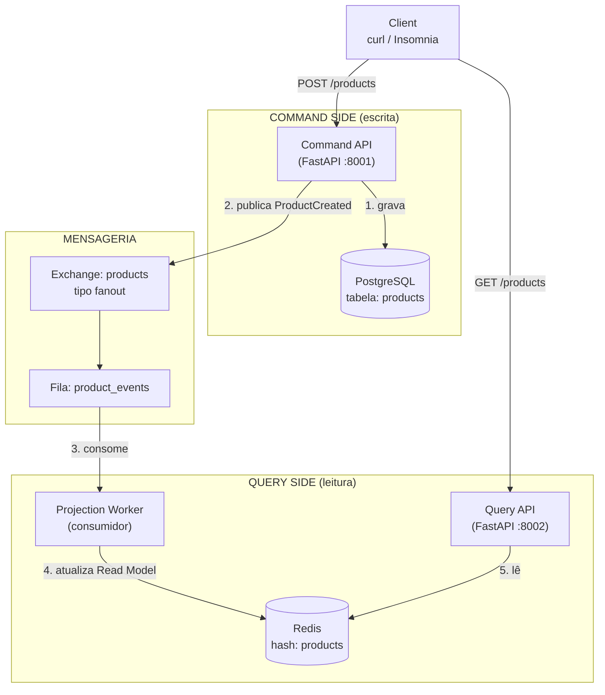
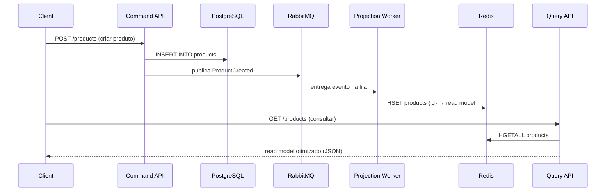

# 04 - CQRS E-commerce

## Descrição

O **CQRS E-commerce** é um projeto focado na aplicação do padrão **Command Query Responsibility Segregation (CQRS)** em um cenário de e-commerce. O objetivo é separar completamente as operações de escrita (**Command Side**) das operações de leitura (**Query Side**), utilizando eventos para manter ambos os modelos sincronizados. Durante o desenvolvimento serão explorados conceitos como consistência eventual, mensageria, projeções, modelos de leitura otimizados e comunicação assíncrona entre componentes.

## Arquitetura

### Visão Geral dos Componentes



### Sequência do Fluxo (criação de produto → consulta)



### Fluxo em Texto (resumo rápido)

```
Client ──POST──► Command API ──► PostgreSQL (escreve)
                 Command API ──► RabbitMQ (publica ProductCreated)
                                   │
                                   ▼
                            Projection Worker
                                   │
                                   ▼
                                  Redis (read model)
                                   ▲
Client ──GET──► Query API ─────────┘
```

---

## Stack

* **FastAPI** — Desenvolvimento das APIs de Command e Query.
* **PostgreSQL** — Persistência do modelo de escrita (Command Side).
* **RabbitMQ** — Publicação e consumo de eventos para sincronização entre escrita e leitura.
* **Redis** — Armazenamento do modelo de leitura (Read Model) otimizado para consultas.
* **Docker & Docker Compose** — Orquestração de toda a infraestrutura local.

---

## Objetivos do Projeto

* Aplicar o padrão CQRS em um sistema de e-commerce.
* Separar responsabilidades de escrita e leitura.
* Publicar eventos após alterações no modelo de domínio.
* Construir projeções utilizando um Worker consumidor.
* Manter um Read Model otimizado no Redis.
* Explorar consistência eventual entre Command e Query.
* Entender os benefícios arquiteturais da separação entre operações de escrita e leitura.

## Componentes da Arquitetura

* Command API (Backend)

Responsável pelas operações de escrita da aplicação, recebendo comandos para criação, atualização e remoção de produtos. Todas as alterações são persistidas no PostgreSQL e publicam eventos para sincronização do modelo de leitura.

* Query API (Backend)

Responsável exclusivamente pelas consultas da aplicação. Todas as leituras são realizadas a partir do Read Model armazenado no Redis, sem acessar diretamente o banco transacional.

* Projection Worker

Consumidor dos eventos publicados pelo Command Side. Sua responsabilidade é processar os eventos e atualizar o Read Model, mantendo a sincronização entre escrita e leitura.

* PostgreSQL (Command Database)

Banco de dados transacional utilizado apenas pelo Command Side para armazenar o estado oficial da aplicação.

* RabbitMQ (Message Broker)

Broker responsável por transportar os eventos gerados pelo Command Side até o Projection Worker, desacoplando escrita e leitura.

* Redis (Read Model)

Banco em memória utilizado como modelo de leitura (Read Model), armazenando projeções otimizadas para consultas rápidas e independentes do banco transacional.

## Estrutura do Projeto

```
04-ecommerce-cqrs/
├── command-api/                # API de escrita (FastAPI)
│   ├── Dockerfile
│   ├── requirements.txt
│   └── app/
│       ├── __init__.py
│       ├── config.py
│       ├── database.py
│       ├── main.py
│       ├── models/
│       │   ├── __init__.py
│       │   └── product.py
│       ├── schemas/
│       │   ├── __init__.py
│       │   └── product.py
│       └── repositories/
│           ├── __init__.py
│           └── product.py
├── query-api/                  # API de leitura (FastAPI)
│   ├── Dockerfile
│   ├── requirements.txt
│   └── app/
│       ├── __init__.py
│       ├── config.py
│       └── main.py
├── projection-worker/          # Consumidor de eventos
│   ├── Dockerfile
│   ├── requirements.txt
│   └── app/
│       ├── __init__.py
│       ├── config.py
│       └── main.py
├── shared/
│   ├── __init__.py
│   ├── events/                 # Definição dos eventos
│   │   └── __init__.py
│   ├── schemas/                # Schemas compartilhados
│   │   └── __init__.py
│   └── common/                 # Utilitários comuns
│       └── __init__.py
├── docker/
├── docker-compose.yml
├── .env.example
├── .gitignore
└── README.md
```

## Eventos do Projeto

### ProductCreated

Publicado quando um novo produto é criado no Command Side.

```json
{
  "event": "ProductCreated",
  "product_id": 1,
  "name": "Mechanical Keyboard",
  "price": 399.90,
  "stock": 10,
  "category": "Keyboards"
}
```

### ProductUpdated

Publicado quando um produto existente é alterado.

```json
{
  "event": "ProductUpdated",
  "product_id": 1,
  "name": "Mechanical Keyboard RGB",
  "price": 449.90,
  "stock": 5,
  "category": "Keyboards"
}
```

### ProductDeleted

Publicado quando um produto é removido.

```json
{
  "event": "ProductDeleted",
  "product_id": 1
}
```

# [OK] Epic 1 — Fundação

## [OK] Card 1 — Criar estrutura inicial do projeto

Descrição: Criar a estrutura de diretórios definida em Estrutura do Projeto: command-api, query-api, projection-worker, shared/events, shared/schemas, shared/common, docker/ e docker-compose.yml.

## [OK] Card 2 — Configurar ambiente Docker

Descrição: Subir FastAPI, PostgreSQL, RabbitMQ, Redis e garantir comunicação entre containers.

## [OK] Card 3 — Configurar persistência inicial

Descrição: Criar banco PostgreSQL exclusivo para operações de escrita (Command Side).

# [OK] Epic 2 — Command Side

## [OK] Card 4 — Implementar domínio de produtos

Descrição: Criar entidade Product com regras de negócio e persistência no banco principal.

## [OK] Card 5 — Criar endpoint de criação de produtos

Descrição: Implementar apenas a criação de produtos no Command Side.

## [OK] Card 6 — Persistir comandos corretamente

Descrição: Garantir que alterações sejam gravadas apenas no banco de escrita.

# [OK] Epic 3 — Eventos

## [OK] Card 7 — Configurar RabbitMQ

Descrição: Preparar exchanges, filas e conexões para publicação de eventos de domínio.

## [OK] Card 8 — Publicar eventos de produto

Descrição: Emitir eventos após criar, atualizar ou remover produtos.

## [OK] Card 9 — Validar fluxo de eventos

Descrição: Garantir publicação correta após cada alteração realizada pelo Command Side.

# [OK] Epic 4 — Projection Worker

## [OK] Card 10 — Criar Projection Worker

Descrição: Consumir eventos publicados e iniciar atualização do modelo de leitura.

## [OK] Card 11 — Processar eventos recebidos

Descrição: Interpretar eventos e preparar dados para consultas otimizadas.

## [OK] Card 12 — Atualizar Read Model

Descrição: Sincronizar Redis sempre que novos eventos forem processados.

# [*] Epic 5 — Query Side

## [*] Card 13 — Criar Query API

Descrição: Implementar API dedicada exclusivamente para consultas rápidas.

## [*] Card 14 — Buscar dados apenas do Redis

Descrição: Nunca consultar PostgreSQL durante operações de leitura.

## [*] Card 15 — Criar consultas otimizadas

Descrição: Implementar listagens e buscas simplificadas utilizando o modelo de leitura.

# [*] Epic 6 — Evolução do Modelo

## [*] Card 16 — Criar modelos independentes

Descrição: Diferenciar estrutura do banco transacional e estrutura otimizada para consultas.

## [*] Card 17 — Adicionar informações derivadas

Descrição: Incluir campos calculados apenas no Read Model para acelerar consultas.

## [*] Card 18 — Validar consistência eventual

Descrição: Observar atraso natural entre escrita e atualização do modelo de leitura.

# [*] Epic 7 — Atualizações

## [*] Card 19 — Atualizar produtos

Descrição: Refletir alterações no banco principal e propagar eventos automaticamente.

## [*] Card 20 — Remover produtos

Descrição: Excluir registros e manter sincronização entre escrita e leitura.

## [*] Card 21 — Validar sincronização completa

Descrição: Garantir consistência entre PostgreSQL, RabbitMQ, Worker e Redis.

# [*] Epic 8 — Resiliência

## [*] Card 22 — Tratar falhas no processamento

Descrição: Evitar perda de eventos durante falhas temporárias do Worker.

## [*] Card 23 — Implementar retry

Descrição: Reprocessar mensagens que falharem antes do descarte definitivo.

## [*] Card 24 — Adicionar Dead Letter Queue

Descrição: Direcionar mensagens inválidas para análise posterior.

# [*] Epic 9 — Performance

## [*] Card 25 — Medir ganho das consultas

Descrição: Comparar consultas utilizando PostgreSQL e Redis separadamente.

## [*] Card 26 — Validar escalabilidade

Descrição: Demonstrar independência entre operações de leitura e escrita.

# [*] Epic 10 — Fluxo Final

## [*] Card 27 — Executar fluxo completo

Descrição: Criar produto, publicar evento, atualizar Read Model e consultar pelo Query Side.

O que mais gosto nesse projeto

Esse projeto ensina algo que pouca gente pratica em estudos: os modelos de escrita e leitura não precisam ser iguais.

Por exemplo, no Command Side, você pode ter uma entidade normal:

Product
- id
- name
- description
- price
- stock
- category

Já no Query Side, armazenado no Redis, você pode manter um documento pronto para consumo:

```json
{
  "id": 10,
  "name": "Mechanical Keyboard",
  "price": 399.90,
  "category": "Keyboards",
  "in_stock": true
}
```

Perceba que campos derivados já estão calculados e o formato é otimizado para leitura. É justamente essa liberdade de ter dois modelos diferentes para dois objetivos diferentes que faz o CQRS valer a pena. Quando você chegar ao Projeto 05 (Kafka), verá que o RabbitMQ usado aqui para propagar eventos pode ser substituído por uma plataforma de streaming, mas a ideia de manter projeções e modelos de leitura independentes continuará exatamente a mesma.
