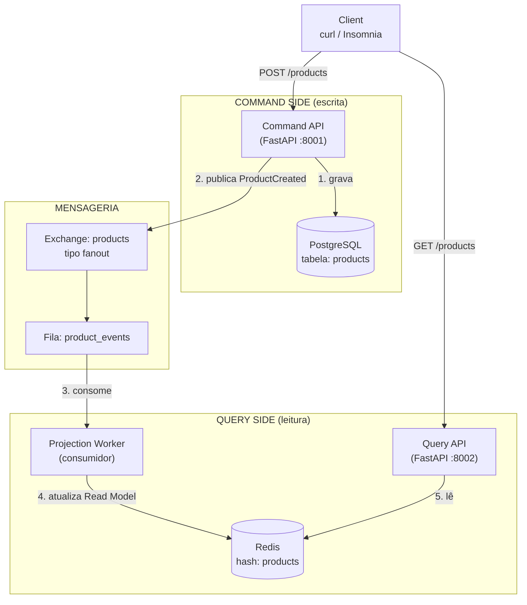
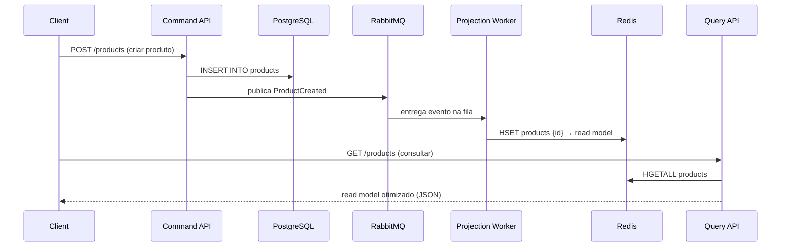

# 04 - CQRS E-commerce

## Descrição

O **CQRS E-commerce** é um projeto focado na aplicação do padrão **Command Query Responsibility Segregation (CQRS)** em um cenário de e-commerce. O objetivo é separar completamente as operações de escrita (**Command Side**) das operações de leitura (**Query Side**), utilizando eventos para manter ambos os modelos sincronizados. Durante o desenvolvimento serão explorados conceitos como consistência eventual, mensageria, projeções, modelos de leitura otimizados e comunicação assíncrona entre componentes.

## Arquitetura

### Visão Geral dos Componentes



### Sequência do Fluxo (criação de produto → consulta)



### Fluxo em Texto (resumo rápido)

```
Client ──POST──► Command API ──► PostgreSQL (escreve)
                 Command API ──► RabbitMQ (publica ProductCreated)
                                   │
                                   ▼
                            Projection Worker
                                   │
                                   ▼
                                  Redis (read model)
                                   ▲
Client ──GET──► Query API ─────────┘
```

---

## Stack

* **FastAPI** — Desenvolvimento das APIs de Command e Query.
* **PostgreSQL** — Persistência do modelo de escrita (Command Side).
* **RabbitMQ** — Publicação e consumo de eventos para sincronização entre escrita e leitura.
* **Redis** — Armazenamento do modelo de leitura (Read Model) otimizado para consultas.
* **Docker & Docker Compose** — Orquestração de toda a infraestrutura local.

---

## Objetivos do Projeto

* Aplicar o padrão CQRS em um sistema de e-commerce.
* Separar responsabilidades de escrita e leitura.
* Publicar eventos após alterações no modelo de domínio.
* Construir projeções utilizando um Worker consumidor.
* Manter um Read Model otimizado no Redis.
* Explorar consistência eventual entre Command e Query.
* Entender os benefícios arquiteturais da separação entre operações de escrita e leitura.

## Componentes da Arquitetura

* Command API (Backend)

Responsável pelas operações de escrita da aplicação, recebendo comandos para criação, atualização e remoção de produtos. Todas as alterações são persistidas no PostgreSQL e publicam eventos para sincronização do modelo de leitura.

* Query API (Backend)

Responsável exclusivamente pelas consultas da aplicação. Todas as leituras são realizadas a partir do Read Model armazenado no Redis, sem acessar diretamente o banco transacional.

* Projection Worker

Consumidor dos eventos publicados pelo Command Side. Sua responsabilidade é processar os eventos e atualizar o Read Model, mantendo a sincronização entre escrita e leitura.

* PostgreSQL (Command Database)

Banco de dados transacional utilizado apenas pelo Command Side para armazenar o estado oficial da aplicação.

* RabbitMQ (Message Broker)

Broker responsável por transportar os eventos gerados pelo Command Side até o Projection Worker, desacoplando escrita e leitura.

* Redis (Read Model)

Banco em memória utilizado como modelo de leitura (Read Model), armazenando projeções otimizadas para consultas rápidas e independentes do banco transacional.

## Estrutura do Projeto

```
04-ecommerce-cqrs/
├── command-api/                # API de escrita (FastAPI)
│   ├── Dockerfile
│   ├── requirements.txt
│   └── app/
│       ├── __init__.py
│       ├── config.py
│       ├── database.py
│       ├── main.py
│       ├── models/
│       │   ├── __init__.py
│       │   └── product.py
│       ├── schemas/
│       │   ├── __init__.py
│       │   └── product.py
│       └── repositories/
│           ├── __init__.py
│           └── product.py
├── query-api/                  # API de leitura (FastAPI)
│   ├── Dockerfile
│   ├── requirements.txt
│   └── app/
│       ├── __init__.py
│       ├── config.py
│       ├── main.py
│       └── repositories/
│           ├── __init__.py
│           └── product.py
├── projection-worker/          # Consumidor de eventos
│   ├── Dockerfile
│   ├── requirements.txt
│   └── app/
│       ├── __init__.py
│       ├── config.py
│       ├── main.py
│       └── projection.py
├── shared/
│   ├── __init__.py
│   ├── events/                 # Definição dos eventos
│   │   └── __init__.py
│   ├── schemas/                # Schemas compartilhados
│   │   ├── __init__.py
│   │   └── read_models/        # Read Models (contrato da leitura)
│   │       ├── __init__.py
│   │       └── product.py
│   └── common/                 # Utilitários comuns
│       └── __init__.py
├── docker/
├── scripts/                    # Scripts de validação
│   ├── validate_eventual_consistency.py
│   └── validate_sync.py
├── docker-compose.yml
├── .env.example
├── .gitignore
└── README.md
```

## Eventos do Projeto

### ProductCreated

Publicado quando um novo produto é criado no Command Side.

```json
{
  "event": "ProductCreated",
  "product_id": 1,
  "name": "Mechanical Keyboard",
  "price": 399.90,
  "stock": 10,
  "category": "Keyboards"
}
```

### ProductUpdated

Publicado quando um produto existente é alterado.

```json
{
  "event": "ProductUpdated",
  "product_id": 1,
  "name": "Mechanical Keyboard RGB",
  "price": 449.90,
  "stock": 5,
  "category": "Keyboards"
}
```

### ProductDeleted

Publicado quando um produto é removido.

```json
{
  "event": "ProductDeleted",
  "product_id": 1
}
```

# [OK] Epic 1 — Fundação

## [OK] Card 1 — Criar estrutura inicial do projeto

Descrição: Criar a estrutura de diretórios definida em Estrutura do Projeto: command-api, query-api, projection-worker, shared/events, shared/schemas, shared/common, docker/ e docker-compose.yml.

## [OK] Card 2 — Configurar ambiente Docker

Descrição: Subir FastAPI, PostgreSQL, RabbitMQ, Redis e garantir comunicação entre containers.

## [OK] Card 3 — Configurar persistência inicial

Descrição: Criar banco PostgreSQL exclusivo para operações de escrita (Command Side).

# [OK] Epic 2 — Command Side

## [OK] Card 4 — Implementar domínio de produtos

Descrição: Criar entidade Product com regras de negócio e persistência no banco principal.

## [OK] Card 5 — Criar endpoint de criação de produtos

Descrição: Implementar apenas a criação de produtos no Command Side.

## [OK] Card 6 — Persistir comandos corretamente

Descrição: Garantir que alterações sejam gravadas apenas no banco de escrita.

# [OK] Epic 3 — Eventos

## [OK] Card 7 — Configurar RabbitMQ

Descrição: Preparar exchanges, filas e conexões para publicação de eventos de domínio.

## [OK] Card 8 — Publicar eventos de produto

Descrição: Emitir eventos após criar, atualizar ou remover produtos.

## [OK] Card 9 — Validar fluxo de eventos

Descrição: Garantir publicação correta após cada alteração realizada pelo Command Side.

# [OK] Epic 4 — Projection Worker

## [OK] Card 10 — Criar Projection Worker

Descrição: Consumir eventos publicados e iniciar atualização do modelo de leitura.

## [OK] Card 11 — Processar eventos recebidos

Descrição: Interpretar eventos e preparar dados para consultas otimizadas.

## [OK] Card 12 — Atualizar Read Model

Descrição: Sincronizar Redis sempre que novos eventos forem processados.

# [OK] Epic 5 — Query Side

## [OK] Card 13 — Criar Query API

Descrição: Implementar API dedicada exclusivamente para consultas rápidas.

Endpoints de leitura (leem apenas o Read Model no Redis):

```bash
# Listar todos os produtos (Read Model)
curl http://localhost:8002/products

# Buscar produto por id (Read Model)
curl http://localhost:8002/products/{id}
```

Exemplo de resposta:

```json
[
  {
    "id": 20,
    "name": "Monitor 27",
    "price": 1299.0,
    "category": "Display",
    "in_stock": false
  }
]
```

Observação: `description` e `stock` não aparecem — o Read Model é desnormalizado e otimizado para consulta.

## [OK] Card 14 — Buscar dados apenas do Redis

Descrição: Nunca consultar PostgreSQL durante operações de leitura.

## [OK] Card 15 — Criar consultas otimizadas

Descrição: Implementar listagens e buscas simplificadas utilizando o modelo de leitura.

O `GET /products` aceita filtros, busca, ordenação e paginação (tudo em memória, apenas sobre o Read Model do Redis):

```bash
# Filtro por categoria
curl "http://localhost:8002/products?category=Display"

# Filtro por disponibilidade em estoque
curl "http://localhost:8002/products?in_stock=false"

# Busca por nome (case-insensitive)
curl "http://localhost:8002/products?q=monitor"

# Ordenação por preço (asc/desc) ou nome
curl "http://localhost:8002/products?sort=price&order=desc"

# Paginação
curl "http://localhost:8002/products?limit=2&offset=2"

# Combinação
curl "http://localhost:8002/products?category=Perifericos&in_stock=true&sort=price"
```

Query params suportados: `category`, `in_stock`, `q`, `sort` (`name`/`price`), `order` (`asc`/`desc`), `limit` (1–200), `offset`.

# [OK] Epic 6 — Evolução do Modelo

## [OK] Card 16 — Criar modelos independentes

Descrição: Diferenciar estrutura do banco transacional e estrutura otimizada para consultas.

### Write Model vs Read Model

| | Write Model | Read Model |
|---|---|---|
| Localização | `command-api/app/models/product.py` | `shared/schemas/read_models/product.py` |
| Representação | Classe SQLAlchemy | Schema Pydantic |
| Storage | Tabela `products` (PostgreSQL) | Hash `products` (Redis) |
| Campos | `id, name, description, price, stock, category` | `id, name, price, category, in_stock` |
| Dono | Command Side | Query Side (projetado pelo worker) |

O Read Model agora é um **contrato explícito e único** em `shared/schemas/read_models/`, consumido pelo projection-worker (escreve) e pela Query API (lê) — a estrutura local duplicada na Query API foi removida.

Nota: o campo `in_stock` já é um exemplo de evolução independente — foi adicionado ao Read Model (Card 11/12) sem tocar no Write Model.

## [OK] Card 17 — Adicionar informações derivadas

Descrição: Incluir campos calculados apenas no Read Model para acelerar consultas.

Campos derivados calculados **apenas** no Read Model (em `projection.py`, durante a projeção):

| Campo | Derivado de | Para que serve |
|---|---|---|
| `in_stock` | `stock > 0` | Filtro sem calcular a cada requisição |
| `formatted_price` | `price` formatado ("R$ 1.299,00") | Exibição pronta, sem formatação na leitura |
| `price_tier` | `price` (<200 low, <1000 medium, senão high) | Filtro rápido por faixa de preço |
| `name_normalized` | `name` em minúsculas | Busca (`q`) e ordenação (`sort=name`) sem `lower()` a cada leitura |

```bash
# Filtrar por faixa de preço (campo derivado)
curl "http://localhost:8002/products?price_tier=high"

# Busca usa name_normalized pré-calculado
curl "http://localhost:8002/products?q=MOUSE"

# Ordenação por nome usa name_normalized
curl "http://localhost:8002/products?sort=name"
```

Exemplo de resposta (Read Model completo):

```json
{
  "id": 26,
  "name": "Mouse Gamer",
  "price": 149.9,
  "category": "Perifericos",
  "in_stock": true,
  "formatted_price": "R$ 149,90",
  "price_tier": "low",
  "name_normalized": "mouse gamer"
}
```

## [OK] Card 18 — Validar consistência eventual

Descrição: Observar atraso natural entre escrita e atualização do modelo de leitura.

Em CQRS, a escrita é confirmada no Command Side imediatamente, mas o Read Model só é atualizado depois que o evento atravessa o RabbitMQ e é projetado pelo worker — existe uma **janela de consistência eventual** entre os dois.

Script de validação (roda no host, sem dependências):

```bash
python scripts/validate_eventual_consistency.py
```

Saída típica:

```
[1] Escrita no Command API: id=29 (Consistencia Eventual 1785780010) em 28.6 ms
[2] Consulta IMEDIATA no Query API: visivel? False
[3] Produto visivel no Read Model apos 2 ms
```

Para tornar a janela observável (simular projeção lenta/atrasada), o worker aceita `PROJECTION_DELAY_SECONDS` (`.env`):

```bash
# .env
PROJECTION_DELAY_SECONDS=2
```

# [OK] Epic 7 — Atualizações

## [OK] Card 19 — Atualizar produtos

Descrição: Refletir alterações no banco principal e propagar eventos automaticamente.

O `PUT /products/{id}` atualiza o produto no PostgreSQL (apenas os campos enviados) e publica `ProductUpdated`. O worker reprojeta o Read Model automaticamente.

```bash
# Atualização parcial (só os campos enviados)
curl -X PUT http://localhost:8001/products/32 \
  -H "Content-Type: application/json" \
  -d '{"price": 179.9, "stock": 0}'

# Limpar description (null explícito)
curl -X PUT http://localhost:8001/products/32 \
  -H "Content-Type: application/json" \
  -d '{"description": null}'
```

Comportamento:
- `404` se o produto não existe
- `422` se a validação falhar (ex: `price <= 0`)
- Campos derivados do Read Model (`in_stock`, `formatted_price`, `price_tier`, `name_normalized`) são recalculados na projeção

## [OK] Card 20 — Remover produtos

Descrição: Excluir registros e manter sincronização entre escrita e leitura.

O `DELETE /products/{id}` exclui o produto no PostgreSQL e publica `ProductDeleted`. O worker remove a chave do hash `products` no Redis (HDEL).

```bash
curl -X DELETE http://localhost:8001/products/34   # -> 204 No Content
curl -X DELETE http://localhost:8001/products/999  # -> 404 Product not found
```

No worker (log de projeção):

```
Evento recebido: {"event": "ProductDeleted", "product_id": 34}
ProductDeleted: produto 34 removido do Read Model (removidos=1)
```

Observação: a remoção do Read Model também respeita a janela de consistência eventual — se `PROJECTION_DELAY_SECONDS > 0`, o PostgreSQL já não tem o produto, mas o Redis ainda o serve até a projeção rodar.

## [OK] Card 21 — Validar sincronização completa

Descrição: Garantir consistência entre PostgreSQL, RabbitMQ, Worker e Redis.

Script de validação de integração (roda no host, sem dependências):

```bash
python scripts/validate_sync.py
```

O que ele verifica:

| Etapa | Verificação | Componentes |
|---|---|---|
| Criação | `POST /products` confirma escrita; fila do RabbitMQ drena para 0; produtos aparecem no Redis | PostgreSQL + RabbitMQ + Worker + Redis |
| Conformidade | Campos (`name`, `price`, `category`) iguais no write e no read; `in_stock` derivado corretamente | PostgreSQL vs Redis |
| Atualização | `PUT` reprojeta no Read Model (`price` e `in_stock` atualizados) | Todos |
| Remoção | `DELETE` remove do Read Model e do PostgreSQL | Todos |
| Limpeza | Fila drena após remover produtos de teste | RabbitMQ |

Saída: `RESULTADO: 14 PASS, 0 FAIL` (exit code `0`; falhas → exit `1`).

Para comparar os dois lados via HTTP, o Command API agora expõe `GET /products` (leitura direta do banco transacional — usada **apenas para validação/observabilidade**, nunca pelo fluxo de leitura da aplicação).

# [*] Epic 8 — Resiliência

## [*] Card 22 — Tratar falhas no processamento

Descrição: Evitar perda de eventos durante falhas temporárias do Worker.

## [*] Card 23 — Implementar retry

Descrição: Reprocessar mensagens que falharem antes do descarte definitivo.

## [*] Card 24 — Adicionar Dead Letter Queue

Descrição: Direcionar mensagens inválidas para análise posterior.

# [*] Epic 9 — Performance

## [*] Card 25 — Medir ganho das consultas

Descrição: Comparar consultas utilizando PostgreSQL e Redis separadamente.

## [*] Card 26 — Validar escalabilidade

Descrição: Demonstrar independência entre operações de leitura e escrita.

# [*] Epic 10 — Fluxo Final

## [*] Card 27 — Executar fluxo completo

Descrição: Criar produto, publicar evento, atualizar Read Model e consultar pelo Query Side.

O que mais gosto nesse projeto

Esse projeto ensina algo que pouca gente pratica em estudos: os modelos de escrita e leitura não precisam ser iguais.

Por exemplo, no Command Side, você pode ter uma entidade normal:

Product
- id
- name
- description
- price
- stock
- category

Já no Query Side, armazenado no Redis, você pode manter um documento pronto para consumo:

```json
{
  "id": 10,
  "name": "Mechanical Keyboard",
  "price": 399.90,
  "category": "Keyboards",
  "in_stock": true
}
```

Perceba que campos derivados já estão calculados e o formato é otimizado para leitura. É justamente essa liberdade de ter dois modelos diferentes para dois objetivos diferentes que faz o CQRS valer a pena. Quando você chegar ao Projeto 05 (Kafka), verá que o RabbitMQ usado aqui para propagar eventos pode ser substituído por uma plataforma de streaming, mas a ideia de manter projeções e modelos de leitura independentes continuará exatamente a mesma.
