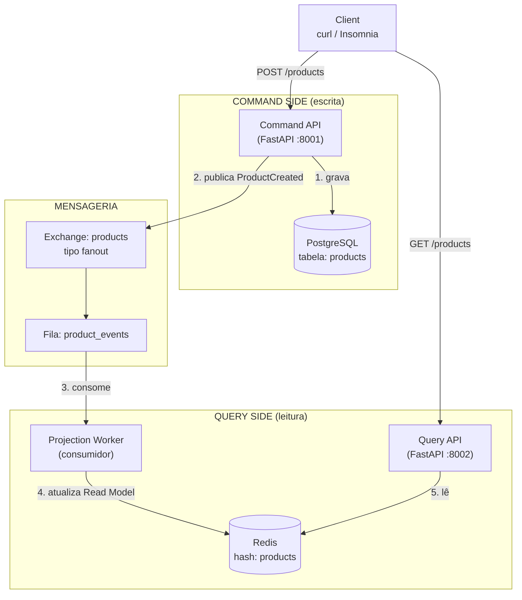
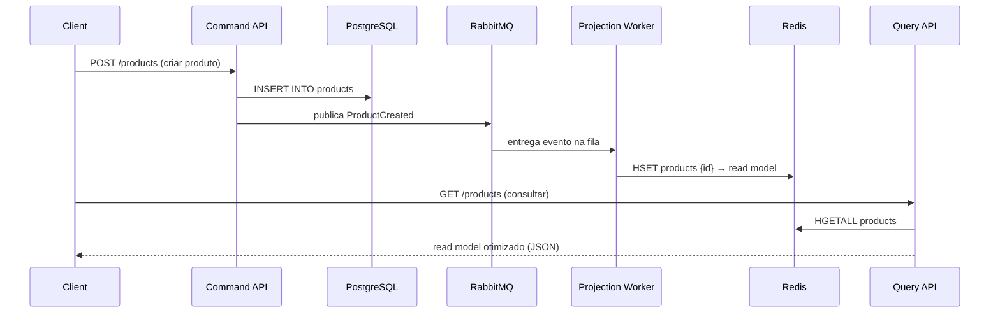

# 04 - CQRS E-commerce

## Descrição

O **CQRS E-commerce** é um projeto focado na aplicação do padrão **Command Query Responsibility Segregation (CQRS)** em um cenário de e-commerce. O objetivo é separar completamente as operações de escrita (**Command Side**) das operações de leitura (**Query Side**), utilizando eventos para manter ambos os modelos sincronizados. Durante o desenvolvimento serão explorados conceitos como consistência eventual, mensageria, projeções, modelos de leitura otimizados e comunicação assíncrona entre componentes.

## Arquitetura

### Visão Geral dos Componentes



### Sequência do Fluxo (criação de produto → consulta)



### Fluxo em Texto (resumo rápido)

```
Client ──POST──► Command API ──► PostgreSQL (escreve)
                 Command API ──► RabbitMQ (publica ProductCreated)
                                   │
                                   ▼
                            Projection Worker
                                   │
                                   ▼
                                  Redis (read model)
                                   ▲
Client ──GET──► Query API ─────────┘
```

---

## Stack

* **FastAPI** — Desenvolvimento das APIs de Command e Query.
* **PostgreSQL** — Persistência do modelo de escrita (Command Side).
* **RabbitMQ** — Publicação e consumo de eventos para sincronização entre escrita e leitura.
* **Redis** — Armazenamento do modelo de leitura (Read Model) otimizado para consultas.
* **Docker & Docker Compose** — Orquestração de toda a infraestrutura local.

---

## Objetivos do Projeto

* Aplicar o padrão CQRS em um sistema de e-commerce.
* Separar responsabilidades de escrita e leitura.
* Publicar eventos após alterações no modelo de domínio.
* Construir projeções utilizando um Worker consumidor.
* Manter um Read Model otimizado no Redis.
* Explorar consistência eventual entre Command e Query.
* Entender os benefícios arquiteturais da separação entre operações de escrita e leitura.

## Componentes da Arquitetura

* Command API (Backend)

Responsável pelas operações de escrita da aplicação, recebendo comandos para criação, atualização e remoção de produtos. Todas as alterações são persistidas no PostgreSQL e publicam eventos para sincronização do modelo de leitura.

* Query API (Backend)

Responsável exclusivamente pelas consultas da aplicação. Todas as leituras são realizadas a partir do Read Model armazenado no Redis, sem acessar diretamente o banco transacional.

* Projection Worker

Consumidor dos eventos publicados pelo Command Side. Sua responsabilidade é processar os eventos e atualizar o Read Model, mantendo a sincronização entre escrita e leitura.

* PostgreSQL (Command Database)

Banco de dados transacional utilizado apenas pelo Command Side para armazenar o estado oficial da aplicação.

* RabbitMQ (Message Broker)

Broker responsável por transportar os eventos gerados pelo Command Side até o Projection Worker, desacoplando escrita e leitura.

* Redis (Read Model)

Banco em memória utilizado como modelo de leitura (Read Model), armazenando projeções otimizadas para consultas rápidas e independentes do banco transacional.

## Estrutura do Projeto

```
04-ecommerce-cqrs/
├── command-api/                # API de escrita (FastAPI)
│   ├── Dockerfile
│   ├── requirements.txt
│   └── app/
│       ├── __init__.py
│       ├── config.py
│       ├── database.py
│       ├── main.py
│       ├── models/
│       │   ├── __init__.py
│       │   └── product.py
│       ├── schemas/
│       │   ├── __init__.py
│       │   └── product.py
│       └── repositories/
│           ├── __init__.py
│           └── product.py
├── query-api/                  # API de leitura (FastAPI)
│   ├── Dockerfile
│   ├── requirements.txt
│   └── app/
│       ├── __init__.py
│       ├── config.py
│       ├── main.py
│       └── repositories/
│           ├── __init__.py
│           └── product.py
├── projection-worker/          # Consumidor de eventos
│   ├── Dockerfile
│   ├── requirements.txt
│   └── app/
│       ├── __init__.py
│       ├── config.py
│       ├── main.py
│       └── projection.py
├── shared/
│   ├── __init__.py
│   ├── events/                 # Definição dos eventos
│   │   ├── __init__.py
│   │   └── product.py
│   ├── schemas/                # Schemas compartilhados
│   │   ├── __init__.py
│   │   └── read_models/        # Read Models (contrato da leitura)
│   │       ├── __init__.py
│   │       └── product.py
│   └── common/                 # Utilitários comuns
│       └── __init__.py
├── scripts/                    # Scripts de validação e utilitários
│   ├── benchmark_queries.py            # Benchmark PostgreSQL vs Redis (Card 25)
│   ├── rebuild_read_model.py           # Reconciliação do Read Model pós-restart (Card 27)
│   ├── validate_eventual_consistency.py
│   ├── validate_flow_complete.py       # Fluxo completo ponta a ponta (Card 27)
│   ├── validate_scalability.py         # Escalabilidade leitura/escrita (Card 26)
│   └── validate_sync.py
├── docker-compose.yml
├── .env.example
├── .gitignore
└── README.md
```

## Como executar

Pré-requisitos: Docker e Docker Compose.

```bash
cp .env.example .env      # ajuste credenciais se necessário
docker compose up -d      # sobe postgres, redis, rabbitmq e as 3 aplicações
```

| Componente | Endereço |
|---|---|
| Command API (escrita) | http://localhost:8001 |
| Query API (leitura) | http://localhost:8002 |
| Painel RabbitMQ | http://localhost:15672 (guest/guest) |
| PostgreSQL | localhost:5432 (`command_db`) |
| Redis | localhost:6379 |

Health checks: `curl http://localhost:8001/health` e `curl http://localhost:8002/health`.

> Nota: RabbitMQ e Redis não usam volume. Ao recriar os containers (`docker compose down`), a fila é recriada do zero e o Read Model é perdido — o PostgreSQL preserva os dados. Use `scripts/rebuild_read_model.py` para reconciliar o Redis (veja o Card 27).

## Eventos do Projeto

### ProductCreated

Publicado quando um novo produto é criado no Command Side.

```json
{
  "event": "ProductCreated",
  "product_id": 1,
  "name": "Mechanical Keyboard",
  "price": 399.90,
  "stock": 10,
  "category": "Keyboards"
}
```

### ProductUpdated

Publicado quando um produto existente é alterado.

```json
{
  "event": "ProductUpdated",
  "product_id": 1,
  "name": "Mechanical Keyboard RGB",
  "price": 449.90,
  "stock": 5,
  "category": "Keyboards"
}
```

### ProductDeleted

Publicado quando um produto é removido.

```json
{
  "event": "ProductDeleted",
  "product_id": 1
}
```

# [OK] Epic 1 — Fundação

## [OK] Card 1 — Criar estrutura inicial do projeto

Descrição: Criar a estrutura de diretórios definida em Estrutura do Projeto: command-api, query-api, projection-worker, shared/events, shared/schemas, shared/common, docker/ e docker-compose.yml.

## [OK] Card 2 — Configurar ambiente Docker

Descrição: Subir FastAPI, PostgreSQL, RabbitMQ, Redis e garantir comunicação entre containers.

## [OK] Card 3 — Configurar persistência inicial

Descrição: Criar banco PostgreSQL exclusivo para operações de escrita (Command Side).

# [OK] Epic 2 — Command Side

## [OK] Card 4 — Implementar domínio de produtos

Descrição: Criar entidade Product com regras de negócio e persistência no banco principal.

## [OK] Card 5 — Criar endpoint de criação de produtos

Descrição: Implementar apenas a criação de produtos no Command Side.

## [OK] Card 6 — Persistir comandos corretamente

Descrição: Garantir que alterações sejam gravadas apenas no banco de escrita.

# [OK] Epic 3 — Eventos

## [OK] Card 7 — Configurar RabbitMQ

Descrição: Preparar exchanges, filas e conexões para publicação de eventos de domínio.

## [OK] Card 8 — Publicar eventos de produto

Descrição: Emitir eventos após criar, atualizar ou remover produtos.

## [OK] Card 9 — Validar fluxo de eventos

Descrição: Garantir publicação correta após cada alteração realizada pelo Command Side.

# [OK] Epic 4 — Projection Worker

## [OK] Card 10 — Criar Projection Worker

Descrição: Consumir eventos publicados e iniciar atualização do modelo de leitura.

## [OK] Card 11 — Processar eventos recebidos

Descrição: Interpretar eventos e preparar dados para consultas otimizadas.

## [OK] Card 12 — Atualizar Read Model

Descrição: Sincronizar Redis sempre que novos eventos forem processados.

# [OK] Epic 5 — Query Side

## [OK] Card 13 — Criar Query API

Descrição: Implementar API dedicada exclusivamente para consultas rápidas.

Endpoints de leitura (leem apenas o Read Model no Redis):

```bash
# Listar todos os produtos (Read Model)
curl http://localhost:8002/products

# Buscar produto por id (Read Model)
curl http://localhost:8002/products/20
```

Exemplo de resposta (Read Model completo, com os campos derivados do Card 17):

```json
[
  {
    "id": 20,
    "name": "Monitor 27",
    "price": 1299.0,
    "category": "Display",
    "in_stock": false,
    "formatted_price": "R$ 1.299,00",
    "price_tier": "high",
    "name_normalized": "monitor 27"
  }
]
```

Observação: `description` e `stock` não aparecem — o Read Model é desnormalizado e otimizado para consulta, com os campos derivados já calculados na projeção.

## [OK] Card 14 — Buscar dados apenas do Redis

Descrição: Nunca consultar PostgreSQL durante operações de leitura.

## [OK] Card 15 — Criar consultas otimizadas

Descrição: Implementar listagens e buscas simplificadas utilizando o modelo de leitura.

O `GET /products` aceita filtros, busca, ordenação e paginação (tudo em memória, apenas sobre o Read Model do Redis):

```bash
# Filtro por categoria
curl "http://localhost:8002/products?category=Display"

# Filtro por disponibilidade em estoque
curl "http://localhost:8002/products?in_stock=false"

# Busca por nome (case-insensitive)
curl "http://localhost:8002/products?q=monitor"

# Ordenação por preço (asc/desc) ou nome
curl "http://localhost:8002/products?sort=price&order=desc"

# Paginação
curl "http://localhost:8002/products?limit=2&offset=2"

# Combinação
curl "http://localhost:8002/products?category=Perifericos&in_stock=true&sort=price"
```

Query params suportados: `category`, `in_stock`, `q`, `sort` (`name`/`price`), `order` (`asc`/`desc`), `limit` (1–200), `offset`.

# [OK] Epic 6 — Evolução do Modelo

## [OK] Card 16 — Criar modelos independentes

Descrição: Diferenciar estrutura do banco transacional e estrutura otimizada para consultas.

### Write Model vs Read Model

| | Write Model | Read Model |
|---|---|---|
| Localização | `command-api/app/models/product.py` | `shared/schemas/read_models/product.py` |
| Representação | Classe SQLAlchemy | Schema Pydantic |
| Storage | Tabela `products` (PostgreSQL) | Hash `products` (Redis) |
| Campos | `id, name, description, price, stock, category` | `id, name, price, category, in_stock` |
| Dono | Command Side | Query Side (projetado pelo worker) |

O Read Model agora é um **contrato explícito e único** em `shared/schemas/read_models/`, consumido pelo projection-worker (escreve) e pela Query API (lê) — a estrutura local duplicada na Query API foi removida.

Nota: o campo `in_stock` já é um exemplo de evolução independente — foi adicionado ao Read Model (Card 11/12) sem tocar no Write Model.

## [OK] Card 17 — Adicionar informações derivadas

Descrição: Incluir campos calculados apenas no Read Model para acelerar consultas.

Campos derivados calculados **apenas** no Read Model (em `projection.py`, durante a projeção):

| Campo | Derivado de | Para que serve |
|---|---|---|
| `in_stock` | `stock > 0` | Filtro sem calcular a cada requisição |
| `formatted_price` | `price` formatado ("R$ 1.299,00") | Exibição pronta, sem formatação na leitura |
| `price_tier` | `price` (<200 low, <1000 medium, senão high) | Filtro rápido por faixa de preço |
| `name_normalized` | `name` em minúsculas | Busca (`q`) e ordenação (`sort=name`) sem `lower()` a cada leitura |

```bash
# Filtrar por faixa de preço (campo derivado)
curl "http://localhost:8002/products?price_tier=high"

# Busca usa name_normalized pré-calculado
curl "http://localhost:8002/products?q=MOUSE"

# Ordenação por nome usa name_normalized
curl "http://localhost:8002/products?sort=name"
```

Exemplo de resposta (Read Model completo):

```json
{
  "id": 26,
  "name": "Mouse Gamer",
  "price": 149.9,
  "category": "Perifericos",
  "in_stock": true,
  "formatted_price": "R$ 149,90",
  "price_tier": "low",
  "name_normalized": "mouse gamer"
}
```

## [OK] Card 18 — Validar consistência eventual

Descrição: Observar atraso natural entre escrita e atualização do modelo de leitura.

Em CQRS, a escrita é confirmada no Command Side imediatamente, mas o Read Model só é atualizado depois que o evento atravessa o RabbitMQ e é projetado pelo worker — existe uma **janela de consistência eventual** entre os dois.

Script de validação (roda no host, sem dependências):

```bash
python scripts/validate_eventual_consistency.py
```

Saída típica:

```
[1] Escrita no Command API: id=29 (Consistencia Eventual 1785780010) em 28.6 ms
[2] Consulta IMEDIATA no Query API: visivel? False
[3] Produto visivel no Read Model apos 2 ms
```

Para tornar a janela observável (simular projeção lenta/atrasada), o worker aceita `PROJECTION_DELAY_SECONDS` (`.env`):

```bash
# .env
PROJECTION_DELAY_SECONDS=2
```

# [OK] Epic 7 — Atualizações

## [OK] Card 19 — Atualizar produtos

Descrição: Refletir alterações no banco principal e propagar eventos automaticamente.

O `PUT /products/{id}` atualiza o produto no PostgreSQL (apenas os campos enviados) e publica `ProductUpdated`. O worker reprojeta o Read Model automaticamente.

```bash
# Atualização parcial (só os campos enviados)
curl -X PUT http://localhost:8001/products/32 \
  -H "Content-Type: application/json" \
  -d '{"price": 179.9, "stock": 0}'

# Limpar description (null explícito)
curl -X PUT http://localhost:8001/products/32 \
  -H "Content-Type: application/json" \
  -d '{"description": null}'
```

Comportamento:
- `404` se o produto não existe
- `422` se a validação falhar (ex: `price <= 0`)
- Campos derivados do Read Model (`in_stock`, `formatted_price`, `price_tier`, `name_normalized`) são recalculados na projeção

## [OK] Card 20 — Remover produtos

Descrição: Excluir registros e manter sincronização entre escrita e leitura.

O `DELETE /products/{id}` exclui o produto no PostgreSQL e publica `ProductDeleted`. O worker remove a chave do hash `products` no Redis (HDEL).

```bash
curl -X DELETE http://localhost:8001/products/34   # -> 204 No Content
curl -X DELETE http://localhost:8001/products/999  # -> 404 Product not found
```

No worker (log de projeção):

```
Evento recebido: {"event": "ProductDeleted", "product_id": 34}
ProductDeleted: produto 34 removido do Read Model (removidos=1)
```

Observação: a remoção do Read Model também respeita a janela de consistência eventual — se `PROJECTION_DELAY_SECONDS > 0`, o PostgreSQL já não tem o produto, mas o Redis ainda o serve até a projeção rodar.

## [OK] Card 21 — Validar sincronização completa

Descrição: Garantir consistência entre PostgreSQL, RabbitMQ, Worker e Redis.

Script de validação de integração (roda no host, sem dependências):

```bash
python scripts/validate_sync.py
```

O que ele verifica:

| Etapa | Verificação | Componentes |
|---|---|---|
| Criação | `POST /products` confirma escrita; fila do RabbitMQ drena para 0; produtos aparecem no Redis | PostgreSQL + RabbitMQ + Worker + Redis |
| Conformidade | Campos (`name`, `price`, `category`) iguais no write e no read; `in_stock` derivado corretamente | PostgreSQL vs Redis |
| Atualização | `PUT` reprojeta no Read Model (`price` e `in_stock` atualizados) | Todos |
| Remoção | `DELETE` remove do Read Model e do PostgreSQL | Todos |
| Limpeza | Fila drena após remover produtos de teste | RabbitMQ |

Saída: `RESULTADO: 14 PASS, 0 FAIL` (exit code `0`; falhas → exit `1`).

Para comparar os dois lados via HTTP, o Command API agora expõe `GET /products` (leitura direta do banco transacional — usada **apenas para validação/observabilidade**, nunca pelo fluxo de leitura da aplicação).

# [OK] Epic 8 — Resiliência

## [OK] Card 22 — Tratar falhas no processamento

Descrição: Evitar perda de eventos durante falhas temporárias do Worker.

Antes: uma falha (ex: Redis fora do ar) derrubava o `start_consuming()` e o worker morria sem restart policy — eventos ficavam presos na fila indefinidamente.

Na época do Card 22, o callback passou a envolver o processamento em `try/except` (sucesso → `basic_ack`; falha → `basic_nack(requeue=True)` + `sleep(1s)`), e o worker ganhou `restart: unless-stopped` — se o processo cair, o Docker reinicia e as mensagens não-acknowledged são redeliveradas. **Nenhum evento se perdia em falha temporária.**

> Evolução (Cards 23–24): o `requeue` simples foi substituído por retry com contador (`x-retry-count`) e backoff exponencial, e o descarte definitivo passou a ir para a DLQ. A garantia de não perder eventos continua, mas os logs atuais mostram `ERRO ... -> republicada com x-retry-count=N` em vez de requeue.

Validação (simulando Redis fora do ar, com o código atual):

```bash
docker compose stop redis                  # indisponibilidade
curl -X POST http://localhost:8001/products -H "Content-Type: application/json" \
  -d '{"name":"Durante Falha","price":123.45,"stock":7,"category":"Teste"}'   # escrita OK
docker compose logs projection-worker      # ERRO (tentativa 1/3) ... -> republicada com x-retry-count=1
docker compose start redis                 # recuperação
docker compose logs projection-worker      # Mensagem N processada e confirmada (acked)
curl http://localhost:8002/products?q=durante   # produto presente: nada foi perdido
```

## [OK] Card 23 — Implementar retry

Descrição: Reprocessar mensagens que falharem antes do descarte definitivo.

O Card 22 fazia requeue infinito com atraso fixo. Agora o retry é controlado:

- **Contador de tentativas**: o worker lê o header `x-retry-count` da mensagem (`MAX_RETRIES` padrão 3). Como o RabbitMQ **não** adiciona `x-death` em requeue simples, na falha o worker **republica** a mensagem no final da fila com o header incrementado e faz ack da original.
- **Backoff exponencial**: espera `RETRY_BASE_DELAY_SECONDS * 2^(tentativa-1)` entre tentativas (1s, 2s, 4s...).
- **Descarte definitivo**: ao atingir `MAX_RETRIES`, `basic_nack(requeue=False)` remove a mensagem da fila (o Card 24 a encaminhará para a DLQ).

Configuração (`.env`):

```
MAX_RETRIES=3
RETRY_BASE_DELAY_SECONDS=1.0
```

Validação (mensagem malformada → sempre falha):

```
Evento recebido (tentativa 1/3): {"event": "ProductCreated", "product_id": 7777}
ERRO (tentativa 1/3): 'name' -> republicada com x-retry-count=1, novo retry em 1.0s
Evento recebido (tentativa 2/3): ... novo retry em 2.0s
Evento recebido (tentativa 3/3): ...
ERRO (tentativa 3 >= max 3): 'name' -> DESCARTE definitivo da mensagem 9
```

Falha temporária (Redis fora do ar) que se resolve dentro do limite:

```
ERRO (tentativa 1/3): ... -> republicada com x-retry-count=1, novo retry em 1.0s
ERRO (tentativa 2/3): ... -> republicada com x-retry-count=2, novo retry em 2.0s
Mensagem 12 processada e confirmada (acked)   # Redis voltou na tentativa 3
```

## [OK] Card 24 — Adicionar Dead Letter Queue

Descrição: Direcionar mensagens inválidas para análise posterior.

Ao esgotar `MAX_RETRIES`, o Card 23 descartava a mensagem com `basic_nack(requeue=False)`. Agora esse descarte é qualificado: a mensagem vai para a **DLQ** em vez de se perder.

Implementação com **dead-letter exchange (DLX)** nativo do RabbitMQ:

- A fila `product_events` é declarada com o argumento `x-dead-letter-exchange: product_events.dlx`.
- O worker declara o exchange `product_events.dlx` (fanout) e a fila `product_events.dlq`, bindada a ele.
- Quando `basic_nack(requeue=False)` é chamado, o próprio RabbitMQ roteia a mensagem para a DLQ — o worker não publica na DLQ manualmente.
- Nomes configuráveis em `config.py` (`dlq_exchange`, `dlq_queue`).

Validação (mensagem malformada → 3 tentativas → DLQ):

```
Evento recebido (tentativa 1/3): {"event": "ProductCreated", "product_id": 6666}
ERRO (tentativa 1/3): 'name' -> republicada com x-retry-count=1, novo retry em 1.0s
Evento recebido (tentativa 3/3): {"event": "ProductCreated", "product_id": 6666}
ERRO (tentativa 3 >= max 3): 'name' -> DESCARTE definitivo da mensagem 3

# Filas após o ciclo:
product_events     | messages: 0  | DLX: product_events.dlx
product_events.dlq | messages: 1  | payload: {"event":"ProductCreated","product_id":6666} | x-retry-count: 2
```

A mensagem na DLQ carrega o header `x-retry-count: 2` (processada 3x) e pode ser inspecionada/consumida para análise posterior sem interferir no fluxo principal. A fila principal nunca fica poluída por mensagens mortas.

> Nota: a fila `product_events` só ganha o argumento DLX na (re)criação — como o RabbitMQ não tem volume neste projeto, basta recriar a fila via API (`DELETE /api/queues/%2F/product_events`) e subir o worker de novo.

# [OK] Epic 9 — Performance

## [OK] Card 25 — Medir ganho das consultas

Descrição: Comparar consultas utilizando PostgreSQL e Redis separadamente.

Benchmark em `scripts/benchmark_queries.py` (`python3 scripts/benchmark_queries.py [N]`). Ele semeia N produtos via Command API (escreve no PostgreSQL + projeta no Redis), mede as consultas e limpa os dados no final.

Com 1000 produtos:

**Nível de armazenamento** (psql vs redis-cli, clientes reconectando a cada iteração — idêntico para ambos):

```
consulta                     media
PG SELECT * (todos)         20.53 ms
Redis HGETALL (todos)       11.01 ms   -> 1.9x mais rápido
PG SELECT WHERE id          15.85 ms
Redis HGET <id>              9.49 ms   -> 1.7x mais rápido
```

**Nível de API** (HTTP + JSON; PG faz 1 chamada retornando todos, Redis paginado em limit=200):

```
consulta                     media
PG list (1 chamada)         24.24 ms
Redis list total (5 chamadas) 67.05 ms   -> varredura total: PG vence (0.4x)
Redis get (1 chamada)         2.46 ms    -> lookup pontual: Redis vence
```

Leitura honesta dos números:

- **Lookup pontual** (padrão de leitura típico do CQRS): Redis `GET /products/{id}` ≈ 2.5 ms via HTTP — o Read Model já vem pronto, sem JOIN nem serialização derivada.
- **Varredura completa**: Redis paginado (limit máx. 200 → 5 chamadas) perde para o `SELECT` único do PostgreSQL (1 round-trip vs 5). O Read Model compensa em leituras pontuais, filtros e campos pré-calculados — não em despejar a tabela inteira.
- **Isolamento**: essas consultas Redis não tocam o banco de escrita, então a leitura nunca disputa recurso com a escrita.

## [OK] Card 26 — Validar escalabilidade

Descrição: Demonstrar independência entre operações de leitura e escrita.

Validação em `scripts/validate_scalability.py` (`python3 scripts/validate_scalability.py [N]`). Semeia N produtos, sobe uma **2ª instância da Query API** (`docker run` na porta :8003 apontando para o mesmo Redis), submete carga de leitura e depois leitura + escrita concorrentes, medindo o PostgreSQL via `pg_stat_user_tables`.

Resultado (N=300):

```
1) SEMEANDO 300 produtos                       [PASS]
2) 2a instancia de leitura (:8003) responde    [PASS]
   ambas instancias leem os MESMOS dados       [PASS]
3) 1600 leituras a 279 req/s (media 27.7ms)    [PASS]
   tabela products: seq_scan 844 -> 844 | idx_scan 9776 -> 9776  (INTOCADA)
4) leitura + 30 escritas concorrentes          [PASS]
   leituras 277 req/s | escritas media 40.2ms, p95 70.3ms
RESULTADO: 7 PASS, 0 FAIL
```

A independência fica provada em três camadas:

- **Escalar leitura**: subir outra instância da Query API é só um container — basta apontar para o mesmo Redis, sem tocar em nada de escrita.
- **Leitura não toca a escrita**: durante 1600 leituras em 2 instâncias, o PostgreSQL não sofreu uma única scan (seq_scan e idx_scan idênticos) — as consultas saem todas do Redis.
- **Escrita não é afetada pela carga de leitura**: POST/DELETE concorrentes completam com p95 de 70ms enquanto a leitura roda a 277 req/s.

### Bugs reais encontrados e corrigidos na validação

1. **Contrato da fila quebrado pelo Card 24**: o `broker.py` do Command API declarava `product_events` sem o argumento DLX; após qualquer reconexão, o RabbitMQ respondia `406 PRECONDITION_FAILED` e **toda escrita virava 500**. Como toda declaração de fila é um contrato, o Command API passou a declarar com os mesmos `x-dead-letter-exchange`/`x-dead-letter-routing-key`. (O `validate_sync` não pegava porque a conexão antiga continuava viva — só falha na reconexão.)
2. **Pika não é thread-safe**: publicações concorrentes no mesmo canal geravam `StreamLostError: pop from an empty deque`. O `publish_event` agora serializa com `threading.Lock` → 30 escritas concorrentes: 30/30 OK.

### Latência de leitura com paginação

`scripts/validate_sync.py` e `validate_scalability.py` leem o Read Model completo via **paginação** (`limit=200`), porque a Query API limita cada página a 200 registros — a lista padrão tem limite de 100.

# [OK] Epic 10 — Fluxo Final

## [OK] Card 27 — Executar fluxo completo

Descrição: Criar produto, publicar evento, atualizar Read Model e consultar pelo Query Side.

Fechamento com `scripts/validate_flow_complete.py` — o ciclo de vida completo de um produto atravessando as quatro camadas:

```
1) ESCREVER  POST /products -> 201, id=3998 (persistido no PostgreSQL)      [PASS]
2) PUBLICAR  fila recebe o evento ProductCreated e drena                     [PASS]
3) PROJETAR  Read Model no Redis: price_tier=high, formatted_price="R$ 1.299,90",
             name_normalized="fluxo completo"                                [PASS]
4) LER       GET /products/3998 (Redis) -> json completo do Read Model       [PASS]
5) ATUALIZAR PUT price=99.9/stock=0 -> reprojetado (low, "R$ 99,90")         [PASS]
6) REMOVER   DELETE -> sumiu do Read Model + GET 404                         [PASS]
RESULTADO: 7 PASS, 0 FAIL
```

Todo o pipeline — Command API (PostgreSQL) → RabbitMQ → Projection Worker → Redis → Query API — funciona ponta a ponta: o modelo de escrita e o Read Model evoluem juntos, mas vivem em bancos separados e nunca se confundem.

### Reconstrução do Read Model (reconciliação pós-restart)

O Redis não tem volume neste projeto — o Read Model é **efêmero**. Se o container do Redis for recriado (`docker compose down`), as projeções se perdem, enquanto o PostgreSQL (com volume) preserva o modelo de escrita. O estado fica assimétrico até que novos eventos fluam.

Para restaurar a consistência sem precisar de replay de eventos (event sourcing), o projeto inclui uma **reconciliação** que reconstrói o Read Model a partir da fonte de verdade:

```bash
docker compose exec projection-worker python /workspace/scripts/rebuild_read_model.py [--clean-test]
```

- Lê todos os produtos do `GET /products` do Command API (PostgreSQL).
- Purga o hash `products` no Redis e reprojeta tudo com o mesmo `build_read_model` usado pelo worker — campos derivados inclusos.
- `--clean-test`: antes de reconstruir, remove do PostgreSQL os produtos residuais de validação (prefixos `Sync`, `Consistencia`, `Conc`, `Bench`, `Scale`, `Teste Validacao`).

Esse padrão de *reconciliação a partir do banco de escrita* é a alternativa pragmática ao replay de eventos quando o Read Model é derivado e descartável — exatamente o caso de uso de um cache de leitura em CQRS.

## O que mais gosto nesse projeto

Esse projeto ensina algo que pouca gente pratica em estudos: os modelos de escrita e leitura não precisam ser iguais.
Por exemplo, no Command Side, você pode ter uma entidade normal:

Product
- id
- name
- description
- price
- stock
- category

Já no Query Side, armazenado no Redis, você pode manter um documento pronto para consumo:

```json
{
  "id": 10,
  "name": "Mechanical Keyboard",
  "price": 399.90,
  "category": "Keyboards",
  "in_stock": true
}
```

Perceba que campos derivados já estão calculados e o formato é otimizado para leitura. É justamente essa liberdade de ter dois modelos diferentes para dois objetivos diferentes que faz o CQRS valer a pena. Quando você chegar ao Projeto 05 (Kafka), verá que o RabbitMQ usado aqui para propagar eventos pode ser substituído por uma plataforma de streaming, mas a ideia de manter projeções e modelos de leitura independentes continuará exatamente a mesma.
