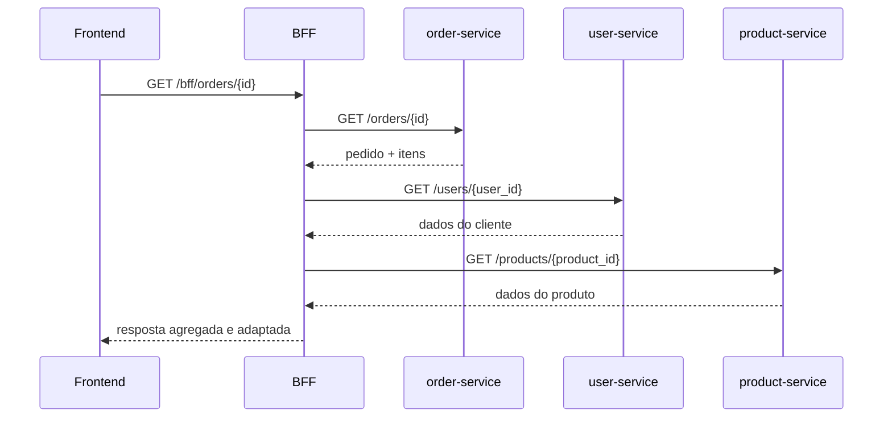

# 07 — Backend for Frontend (BFF)

## 📖 Descrição

O **BFF (Backend for Frontend)** é um padrão arquitetural que consiste em criar uma camada de backend dedicada ao frontend, responsável por **orquestrar chamadas a múltiplos serviços internos** e devolver uma resposta já montada, adaptada e pronta para consumo.

Sem um BFF, o frontend precisaria chamar cada serviço separadamente, montar os dados no lado do cliente e lidar com erros de cada dependência de forma individual. Com o BFF, essa complexidade é absorvida pelo backend: o frontend faz uma única chamada e recebe exatamente o que precisa — sem lógica de composição no cliente.

Este projeto implementa o padrão de forma simples e autocontida, com três serviços downstream independentes e um BFF que os orquestra via REST. O domínio adotado é o de **e-commerce / pedidos**, o mesmo fio condutor dos projetos anteriores desta trilha.

---

## 🏗️ Arquitetura

### Visão Geral

```
Frontend (React)
       │
       │  1 chamada
       ▼
  BFF (FastAPI :8000)
       │
       ├──► user-service    (FastAPI :8001)  →  dados do cliente
       ├──► product-service (FastAPI :8002)  →  dados dos produtos
       └──► order-service   (FastAPI :8003)  →  pedidos e status
```

### Fluxo de uma requisição

O frontend solicita a tela de **detalhe de um pedido**. Sem o BFF, precisaria de três chamadas separadas. Com o BFF:

```
Frontend ──GET /bff/orders/{id}──► BFF
                                    │
                                    ├──► GET order-service/orders/{id}     → pedido + itens
                                    ├──► GET user-service/users/{user_id}  → dados do cliente
                                    └──► GET product-service/products/{id} → detalhes dos produtos
                                    │
                                    └──► agrega, adapta e responde ◄── Frontend
```

### Sequência



---

## 🚀 Stack

| Camada | Tecnologia |
|--------|-----------|
| Frontend | React + TypeScript + Vite |
| BFF | Python + FastAPI |
| Serviços downstream | Python + FastAPI (user, product, order) |
| Cache (fase posterior) | Redis |
| Infraestrutura | Docker Compose |

---

## 🎯 Objetivos do Projeto

- Entender o papel do BFF como camada de orquestração entre frontend e serviços internos.
- Implementar **API Composition**: agregar dados de múltiplos serviços em uma única resposta.
- Demonstrar a diferença entre o frontend chamando serviços diretamente versus via BFF.
- Adaptar e moldar a resposta para o formato que o frontend realmente precisa.
- Tratar falhas parciais: o BFF responde mesmo que um serviço downstream esteja indisponível.
- Adicionar cache na camada do BFF para evitar chamadas redundantes aos serviços (fase posterior).

---

## 🧩 Domínio

O domínio adotado é o de **e-commerce / pedidos**, mantendo a continuidade da trilha.

Os três serviços downstream são intencionalmente simples — sem banco de dados, com dados em memória — porque o foco do aprendizado é o BFF em si, não a complexidade dos serviços que ele orquestra.

| Serviço | Responsabilidade | Dados expostos |
|---------|-----------------|----------------|
| `user-service` | Gerencia clientes | id, nome, e-mail |
| `product-service` | Catálogo de produtos | id, nome, preço, estoque |
| `order-service` | Pedidos e status | id, user_id, itens, status, total |

**Endpoint principal do BFF:**

```
GET /bff/orders/{order_id}
```

Resposta agregada (exemplo):

```json
{
  "order_id": 1,
  "status": "confirmed",
  "total": 449.90,
  "customer": {
    "name": "Lucas",
    "email": "lucas@example.com"
  },
  "items": [
    {
      "product_name": "Mechanical Keyboard",
      "price": 399.90,
      "quantity": 1
    },
    {
      "product_name": "Mouse Pad",
      "price": 50.00,
      "quantity": 1
    }
  ]
}
```

Nenhum dos três serviços individualmente retornaria isso — é o BFF que compõe.

---

## 📁 Estrutura do Projeto

```
07-bff/
├── README.md
├── docker-compose.yml
├── .env.example
├── .gitignore
│
├── bff/                        # BFF principal
│   ├── Dockerfile
│   ├── requirements.txt
│   └── app/
│       ├── main.py             # FastAPI app
│       ├── config.py           # URLs dos serviços downstream
│       ├── routers/
│       │   └── orders.py       # Endpoints do BFF (ex: GET /bff/orders/{id})
│       ├── clients/            # Clientes HTTP para cada serviço downstream
│       │   ├── user_client.py
│       │   ├── product_client.py
│       │   └── order_client.py
│       └── schemas/            # Schemas Pydantic de resposta do BFF
│           └── order_detail.py
│
├── services/
│   ├── user-service/           # Serviço de usuários (dados em memória)
│   │   ├── Dockerfile
│   │   ├── requirements.txt
│   │   └── app/
│   │       ├── main.py
│   │       └── routers/
│   │           └── users.py
│   │
│   ├── product-service/        # Serviço de produtos (dados em memória)
│   │   ├── Dockerfile
│   │   ├── requirements.txt
│   │   └── app/
│   │       ├── main.py
│   │       └── routers/
│   │           └── products.py
│   │
│   └── order-service/          # Serviço de pedidos (dados em memória)
│       ├── Dockerfile
│       ├── requirements.txt
│       └── app/
│           ├── main.py
│           └── routers/
│               └── orders.py
│
└── frontend/                   # React + TypeScript + Vite
    └── src/
        ├── pages/              # Tela de lista de pedidos e detalhe
        ├── components/         # Componentes reutilizáveis
        └── types/              # Interfaces TypeScript
```

---

## 🔌 Portas

| Serviço | Endereço |
|---------|----------|
| Frontend | http://localhost:5173 |
| BFF | http://localhost:8000 |
| user-service | http://localhost:8001 |
| product-service | http://localhost:8002 |
| order-service | http://localhost:8003 |

---

# [OK] Epic 1 — Fundação

## [OK] Card 1 — Criar estrutura inicial do projeto

Descrição: Criar a estrutura de diretórios definida em Estrutura do Projeto: `bff/`, `services/user-service/`, `services/product-service/`, `services/order-service/`, `frontend/`, `.env.example`, `.gitignore` e `docker-compose.yml` vazio. O objetivo é ter uma base limpa e organizada antes de qualquer serviço ser implementado.

## [OK] Card 2 — Configurar ambiente Docker

Descrição: Configurar o `docker-compose.yml` com os quatro containers de backend: `bff`, `user-service`, `product-service` e `order-service`. Cada serviço deve ter seu `Dockerfile` e expor um endpoint `GET /health` retornando `{"status": "ok"}`. Ao final, todos os containers sobem com `docker compose up --build` sem erros.

Nenhum serviço usa `restart: always` ou `restart: unless-stopped`. O comportamento padrão do Docker (`restart: no`) garante que os containers **não sobem automaticamente** ao ligar ou reiniciar o sistema operacional — é necessário um `docker compose up` explícito.

Validação:

```bash
docker compose up --build -d

curl http://localhost:8000/health  # {"status":"ok","service":"bff"}
curl http://localhost:8001/health  # {"status":"ok","service":"user-service"}
curl http://localhost:8002/health  # {"status":"ok","service":"product-service"}
curl http://localhost:8003/health  # {"status":"ok","service":"order-service"}

docker compose down
```

## [OK] Card 3 — Validar comunicação entre containers

Descrição: Garantir que o BFF consegue alcançar os três serviços downstream pela rede interna do Docker. Configurar as URLs dos serviços no `config.py` do BFF via variáveis de ambiente (`.env`). Validar chamando o health de cada serviço a partir do container do BFF.

O `config.py` usa `pydantic-settings` para ler as URLs dos serviços e o timeout via variáveis de ambiente, com defaults que correspondem aos nomes dos containers no Docker Compose.

O endpoint `GET /health/downstream` do BFF chama o `/health` de cada serviço via `httpx` e retorna um status composto:

- `"status": "ok"` — todos os serviços responderam corretamente.
- `"status": "degraded"` — um ou mais serviços estão inacessíveis.

Validação com todos os serviços no ar:

```bash
curl http://localhost:8000/health/downstream
# {
#   "status": "ok",
#   "downstream": {
#     "user-service":    {"status": "ok", "http_status": 200},
#     "product-service": {"status": "ok", "http_status": 200},
#     "order-service":   {"status": "ok", "http_status": 200}
#   }
# }
```

Validação com `user-service` derrubado (`docker compose stop user-service`):

```bash
curl http://localhost:8000/health/downstream
# {
#   "status": "degraded",
#   "downstream": {
#     "user-service":    {"status": "error", "detail": "..."},
#     "product-service": {"status": "ok", "http_status": 200},
#     "order-service":   {"status": "ok", "http_status": 200}
#   }
# }
```

---

# [OK] Epic 2 — Serviços Downstream

## [OK] Card 4 — Implementar user-service

Descrição: Criar o `user-service` com dados em memória (lista Python). Expor os endpoints `GET /users` (lista todos) e `GET /users/{id}` (busca por id). Retornar 404 quando o usuário não existir. Dados de exemplo: 3 a 5 usuários com `id`, `name` e `email`.

## [OK] Card 5 — Implementar product-service

Descrição: Criar o `product-service` com dados em memória. Expor os endpoints `GET /products` (lista todos) e `GET /products/{id}` (busca por id). Retornar 404 quando o produto não existir. Dados de exemplo: 5 a 10 produtos com `id`, `name`, `price` e `stock`.

## [OK] Card 6 — Implementar order-service

Descrição: Criar o `order-service` com dados em memória. Expor os endpoints `GET /orders` (lista todos) e `GET /orders/{id}` (busca por id). Cada pedido deve conter `id`, `user_id`, `status` (`pending`, `confirmed`, `shipped`, `delivered`), `total` e `items` (lista com `product_id` e `quantity`). Retornar 404 quando o pedido não existir.

## [OK] Card 7 — Validar os três serviços

Descrição: Subir os três serviços via Docker Compose e validar todos os endpoints com `curl`. Confirmar que dados de exemplo estão populados corretamente e que os retornos 404 funcionam. Criar um script `scripts/validate_services.sh` com as chamadas de validação.

---

# [*] Epic 3 — BFF: API Composition

## [OK] Card 8 — Criar estrutura base do BFF

Descrição: Implementar a estrutura do BFF com FastAPI: `main.py`, `config.py` (URLs dos serviços via env), e a camada `clients/` com um cliente HTTP para cada serviço downstream usando `httpx`. Cada cliente deve ter um método de busca por id e um de listagem. Ao final, o BFF sobe no Docker Compose e seu `GET /health` responde corretamente.

## [OK] Card 9 — Implementar GET /bff/orders/{id} — composição completa

Descrição: Implementar o endpoint principal do BFF. Dado um `order_id`, o BFF deve: (1) buscar o pedido no `order-service`; (2) buscar o cliente no `user-service` usando o `user_id` do pedido; (3) buscar os detalhes de cada produto no `product-service` usando os `product_id` dos itens; (4) agregar tudo em uma única resposta com o schema `OrderDetail`. Esse é o coração do padrão BFF — uma chamada do cliente, três chamadas internas.

## [*] Card 10 — Implementar GET /bff/orders — listagem composta

Descrição: Implementar o endpoint de listagem no BFF. Para cada pedido retornado pelo `order-service`, o BFF deve enriquecer a resposta com o nome do cliente (via `user-service`). O objetivo é mostrar que a composição também se aplica a listagens, não apenas a recursos individuais.

## [*] Card 11 — Implementar GET /bff/users/{id}/orders — pedidos por cliente

Descrição: Implementar um terceiro endpoint de composição: dado um `user_id`, retornar os dados do cliente junto com todos os seus pedidos (já enriquecidos com nome dos produtos). Demonstra que o BFF pode oferecer endpoints orientados ao caso de uso do frontend, e não apenas ao modelo interno dos serviços.

---

# [*] Epic 4 — Tratamento de Falhas

## [*] Card 12 — Implementar timeout nas chamadas downstream

Descrição: Configurar timeout em todos os clientes HTTP do BFF (ex: `DOWNSTREAM_TIMEOUT=5` segundos via `.env`). Simular um serviço lento adicionando um delay artificial em um endpoint e validar que o BFF retorna erro dentro do timeout configurado, sem bloquear indefinidamente.

## [*] Card 13 — Tratar serviço downstream indisponível (graceful degradation)

Descrição: Definir o comportamento do BFF quando um serviço downstream está fora do ar. Para dados não críticos (ex: detalhes do produto), o BFF deve retornar a resposta parcial com um indicador de degradação em vez de falhar completamente. Para dados críticos (ex: o pedido em si não carregou), retornar erro com status adequado. Validar parando um serviço com `docker compose stop`.

## [*] Card 14 — Padronizar respostas de erro do BFF

Descrição: Criar um formato de erro consistente para o BFF: `{"error": "mensagem", "service": "qual serviço falhou", "type": "tipo do erro"}`. Garantir que erros de timeout, 404 dos serviços downstream e erros inesperados sempre retornem nesse formato, sem vazar detalhes internos para o cliente.

---

# [*] Epic 5 — Frontend

## [*] Card 15 — Criar estrutura inicial do frontend

Descrição: Inicializar o projeto React com Vite e TypeScript dentro do diretório `frontend/`. Configurar o container no Docker Compose. Criar uma página inicial simples que confirma a conexão com o BFF chamando `GET /health`. Ao final, o frontend sobe em `http://localhost:5173`.

## [*] Card 16 — Tela de lista de pedidos

Descrição: Criar a tela de listagem de pedidos consumindo `GET /bff/orders`. Exibir para cada pedido: id, nome do cliente, status e total. Demonstrar que o frontend recebe dados já compostos, sem precisar saber que existem dois serviços por trás (order e user).

## [*] Card 17 — Tela de detalhe do pedido

Descrição: Criar a tela de detalhe de um pedido consumindo `GET /bff/orders/{id}`. Exibir: dados do cliente, status do pedido, lista de itens com nome do produto, quantidade e preço, e total geral. Todos os dados vêm em uma única resposta do BFF.

## [*] Card 18 — Demonstrar o valor do BFF

Descrição: Criar uma página de comparação no frontend (apenas para fins didáticos): um botão que carrega o detalhe do pedido via BFF (1 chamada) e outro que tenta montar a mesma tela chamando os três serviços diretamente (3 chamadas, montando os dados no cliente). Exibir o número de chamadas e o tempo de cada abordagem. Esse card deixa o contraste visível na prática.

---

# [*] Epic 6 — Cache

## [*] Card 19 — Subir Redis no Docker Compose

Descrição: Adicionar o container Redis ao `docker-compose.yml`. Instalar `redis` (ou `redis[asyncio]`) nas dependências do BFF. Criar um módulo `cache.py` no BFF com funções auxiliares de get/set/delete usando o cliente Redis. Validar que o BFF conecta ao Redis na inicialização.

## [*] Card 20 — Cachear resposta do GET /bff/orders/{id}

Descrição: Implementar cache no endpoint de detalhe do pedido. Na primeira chamada, o BFF orquestra os três serviços e armazena a resposta no Redis com uma TTL configurável (ex: `CACHE_TTL=60` segundos). Nas chamadas seguintes, retorna direto do cache. Adicionar um header de resposta `X-Cache: HIT` ou `X-Cache: MISS` para tornar o comportamento observável.

## [*] Card 21 — Cachear resposta do GET /bff/orders

Descrição: Estender o cache para o endpoint de listagem. Considerar uma TTL menor para listagens (mudam com mais frequência). Validar com `curl -i` que o header `X-Cache` alterna entre MISS e HIT corretamente.

## [*] Card 22 — Validar ganho de performance com cache

Descrição: Criar um script `scripts/benchmark_cache.py` que mede o tempo de resposta do `GET /bff/orders/{id}` sem cache (primeira chamada) e com cache (chamadas seguintes). Exibir a diferença de latência e o número de chamadas aos serviços downstream economizadas.

---

# [*] Epic 7 — Consolidação

## [*] Card 23 — Executar fluxo completo

Descrição: Validar o projeto de ponta a ponta: frontend carrega lista de pedidos via BFF → usuário clica em um pedido → BFF compõe dados dos três serviços → resposta aparece na tela de detalhe → um serviço é derrubado → BFF faz graceful degradation → cache reduz chamadas downstream. Criar um script `scripts/validate_full_flow.sh` documentando cada passo.

## [*] Card 24 — Consolidar aprendizados

Descrição: Revisar o README adicionando uma seção de **Lições Aprendidas**: o que o BFF resolve que uma chamada direta não resolveria, quando faz sentido usar (e quando não faz), e a diferença prática entre BFF e API Gateway. Garantir que toda a infraestrutura sobe com `docker compose up --build` sem configuração manual adicional.
