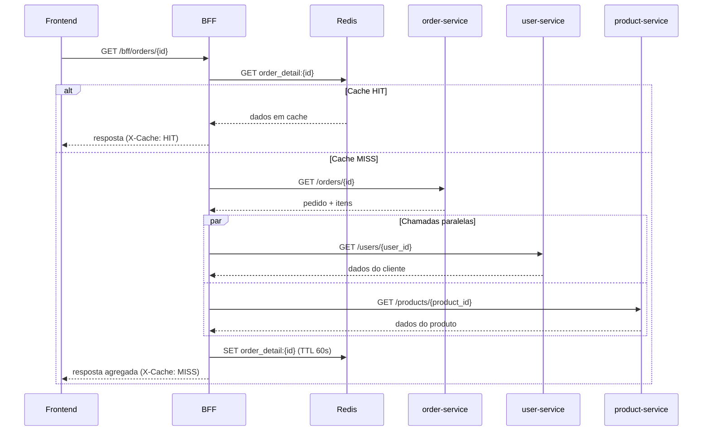

# 07 — Backend for Frontend (BFF)

## 📖 Descrição

O **BFF (Backend for Frontend)** é um padrão arquitetural que consiste em criar uma camada de backend dedicada ao frontend, responsável por **orquestrar chamadas a múltiplos serviços internos** e devolver uma resposta já montada, adaptada e pronta para consumo.

Sem um BFF, o frontend precisaria chamar cada serviço separadamente, montar os dados no lado do cliente e lidar com erros de cada dependência de forma individual. Com o BFF, essa complexidade é absorvida pelo backend: o frontend faz uma única chamada e recebe exatamente o que precisa — sem lógica de composição no cliente.

Este projeto implementa o padrão de forma simples e autocontida, com três serviços downstream independentes e um BFF que os orquestra via REST. O domínio adotado é o de **e-commerce / pedidos**, o mesmo fio condutor dos projetos anteriores desta trilha.

---

## 🏗️ Arquitetura

### Visão Geral

```
Frontend (React)
       │
       │  1 chamada
       ▼
  BFF (FastAPI :8000)  ←──► Redis (cache :6379)
       │
       ├──► user-service    (FastAPI :8001)  →  dados do cliente
       ├──► product-service (FastAPI :8002)  →  dados dos produtos
       └──► order-service   (FastAPI :8003)  →  pedidos e status
```

### Fluxo de uma requisição

O frontend solicita a tela de **detalhe de um pedido**. Sem o BFF, precisaria de três chamadas separadas. Com o BFF:

```
Frontend ──GET /bff/orders/{id}──► BFF
                                    │
                                    ├──► GET order-service/orders/{id}     → pedido + itens
                                    ├──► GET user-service/users/{user_id}  → dados do cliente (paralelo)
                                    └──► GET product-service/products/{id} → detalhes dos produtos (paralelo)
                                    │
                                    ├── verifica cache Redis (MISS → busca; HIT → responde direto)
                                    └──► agrega, adapta e responde ◄── Frontend
```

As chamadas a `user-service` e `product-service` são feitas em **paralelo** com `asyncio.gather`, reduzindo a latência total.

### Sequência (fluxo nominal)



---

## 🚀 Stack

| Camada | Tecnologia |
|--------|-----------|
| Frontend | React 18 + TypeScript + Vite 5 |
| BFF | Python 3.12 + FastAPI + httpx |
| Serviços downstream | Python 3.12 + FastAPI (user, product, order) |
| Cache | Redis 7 |
| Infraestrutura | Docker Compose |

---

## 🎯 Objetivos do Projeto

- Entender o papel do BFF como camada de orquestração entre frontend e serviços internos.
- Implementar **API Composition**: agregar dados de múltiplos serviços em uma única resposta.
- Demonstrar a diferença entre o frontend chamando serviços diretamente versus via BFF.
- Adaptar e moldar a resposta para o formato que o frontend realmente precisa.
- Tratar falhas parciais: o BFF responde mesmo que um serviço downstream esteja indisponível (**graceful degradation**).
- Implementar **timeout** configurável e sinalizar corretamente via HTTP 504.
- Adicionar **cache Redis** na camada do BFF para evitar chamadas redundantes aos serviços.
- Demonstrar o ganho real de performance com o cache (benchmark: MISS vs HIT).

---

## 🧩 Domínio

O domínio adotado é o de **e-commerce / pedidos**, mantendo a continuidade da trilha.

Os três serviços downstream são intencionalmente simples — sem banco de dados, com dados em memória — porque o foco do aprendizado é o BFF em si, não a complexidade dos serviços que ele orquestra.

| Serviço | Responsabilidade | Dados expostos |
|---------|-----------------|----------------|
| `user-service` | Gerencia clientes | id, nome, e-mail |
| `product-service` | Catálogo de produtos | id, nome, preço, estoque |
| `order-service` | Pedidos e status | id, user_id, itens, status, total |

**Endpoint principal do BFF:**

```
GET /bff/orders/{order_id}
```

Resposta agregada (exemplo):

```json
{
  "order_id": 1,
  "status": "confirmed",
  "total": 449.80,
  "is_degraded": false,
  "customer": {
    "name": "Lucas Andrade",
    "email": "lucas@example.com"
  },
  "items": [
    {
      "product_id": 1,
      "product_name": "Mechanical Keyboard",
      "price": 399.90,
      "quantity": 1
    },
    {
      "product_id": 2,
      "product_name": "Mouse Pad XL",
      "price": 49.90,
      "quantity": 1
    }
  ]
}
```

Nenhum dos três serviços individualmente retornaria isso — é o BFF que compõe.

---

## 📁 Estrutura do Projeto

```
07-bff/
├── README.md
├── docker-compose.yml          # Todos os serviços: bff, redis, user, product, order, frontend
├── .env                        # Variáveis de ambiente (copiado de .env.example)
├── .env.example                # Template de variáveis
├── .gitignore
│
├── bff/                        # BFF principal
│   ├── Dockerfile
│   ├── requirements.txt
│   └── app/
│       ├── main.py             # FastAPI app + lifespan (Redis) + handlers de erro
│       ├── config.py           # Settings via pydantic-settings (URLs, timeout, TTL)
│       ├── cache.py            # Funções auxiliares Redis: get/set/delete/ping
│       ├── exceptions.py       # BFFException + handler global
│       ├── routers/
│       │   ├── orders.py       # GET /bff/orders, GET /bff/orders/{id}
│       │   └── users.py        # GET /bff/users/{id}/orders
│       ├── clients/
│       │   ├── user_client.py
│       │   ├── product_client.py
│       │   └── order_client.py
│       └── schemas/
│           ├── order_detail.py # OrderDetail, OrderSummary, CustomerInfo, OrderItemDetail
│           └── user_orders.py  # UserOrdersResponse, CustomerOrderSummary
│
├── services/
│   ├── user-service/
│   │   ├── Dockerfile
│   │   ├── requirements.txt
│   │   └── app/
│   │       ├── main.py
│   │       └── routers/users.py
│   ├── product-service/
│   │   ├── Dockerfile
│   │   ├── requirements.txt
│   │   └── app/
│   │       ├── main.py
│   │       └── routers/products.py
│   └── order-service/
│       ├── Dockerfile
│       ├── requirements.txt
│       └── app/
│           ├── main.py
│           └── routers/orders.py    # Suporta ?delay=N para simular lentidão
│
├── frontend/                        # React 18 + TypeScript + Vite
│   ├── Dockerfile
│   ├── package.json
│   ├── vite.config.ts               # Proxy: /bff, /health, /direct/* → serviços
│   └── src/
│       ├── main.tsx                 # Sem StrictMode (evita double-fetch no dev)
│       ├── App.tsx                  # Navegação por abas
│       ├── App.css
│       ├── types.ts
│       └── components/
│           ├── OrdersList.tsx       # Tela de lista de pedidos
│           ├── OrderDetailView.tsx  # Tela de detalhe do pedido
│           └── ComparisonView.tsx   # Comparação: 1 chamada BFF vs N chamadas diretas
│
└── scripts/
    ├── validate_services.sh         # Valida endpoints dos três microsserviços
    ├── validate_full_flow.sh        # Validação end-to-end (28 checks)
    └── benchmark_cache.py           # Benchmark MISS vs HIT com métricas
```

---

## 🔌 Portas

| Serviço | Endereço |
|---------|----------|
| Frontend | http://localhost:5173 |
| BFF | http://localhost:8000 |
| user-service | http://localhost:8001 |
| product-service | http://localhost:8002 |
| order-service | http://localhost:8003 |
| Redis | localhost:6379 |

---

## 🚦 Endpoints do BFF

| Método | Endpoint | Descrição |
|--------|----------|-----------|
| `GET` | `/health` | Status do BFF |
| `GET` | `/health/downstream` | Status do BFF + Redis + cada serviço downstream |
| `GET` | `/bff/orders` | Lista de pedidos com nome do cliente composto |
| `GET` | `/bff/orders/{id}` | Detalhe do pedido com cliente e produtos compostos |
| `GET` | `/bff/users/{id}/orders` | Pedidos de um cliente com dados dos produtos |

Todos os endpoints de listagem e detalhe suportam o header de resposta `X-Cache: MISS | HIT`.

**Formato de erro padronizado:**

```json
{
  "error": "Descrição do erro",
  "service": "nome-do-serviço",
  "type": "not_found | timeout | service_unavailable | internal_error"
}
```

---

## ⚙️ Configuração (`.env`)

```dotenv
# URLs dos serviços downstream
USER_SERVICE_URL=http://user-service:8001
PRODUCT_SERVICE_URL=http://product-service:8002
ORDER_SERVICE_URL=http://order-service:8003

# Timeout para chamadas downstream (segundos)
DOWNSTREAM_TIMEOUT=5

# Cache Redis
REDIS_URL=redis://redis:6379
CACHE_TTL=60        # TTL para detalhe de pedido (segundos)
LIST_CACHE_TTL=30   # TTL para listagem de pedidos (segundos)
```

---

## 🏃 Como Subir o Projeto

```bash
# 1. Entrar no diretório
cd distributed-systems-playground/07-bff

# 2. Criar o .env a partir do exemplo (já incluído, mas confirme)
cp .env.example .env

# 3. Subir todos os containers
docker compose up --build -d

# 4. Acessar o frontend
open http://localhost:5173

# 5. Derrubar tudo
docker compose down
```

> **Nota:** Nenhum container usa `restart: always` ou `restart: unless-stopped`. Os containers **não sobem automaticamente** ao ligar/reiniciar o sistema — é necessário um `docker compose up` explícito.

---

## 🧪 Validação e Benchmarks

```bash
# Validar os três microsserviços downstream
bash scripts/validate_services.sh

# Validação end-to-end completa (28 checks)
# Cobre: health, composição, cache MISS→HIT, timeout, graceful degradation
bash scripts/validate_full_flow.sh

# Benchmark de cache: mede latência MISS vs HIT e chamadas downstream economizadas
python3 scripts/benchmark_cache.py
python3 scripts/benchmark_cache.py --order-id 2 --iterations 10
```

---

## 🧱 Comportamento de Falhas

| Cenário | Serviço afetado | Resposta do BFF |
|---------|-----------------|-----------------|
| Serviço indisponível | `order-service` (crítico) | HTTP 503 |
| Serviço indisponível | `user-service` ou `product-service` | HTTP 200 com `is_degraded: true` e valores fallback |
| Timeout (> `DOWNSTREAM_TIMEOUT`s) | Qualquer serviço | HTTP 504 |
| Pedido não encontrado | `order-service` | HTTP 404 |
| Redis indisponível | — | BFF segue funcionando (cache é best-effort) |

---

# [OK] Epic 1 — Fundação

## [OK] Card 1 — Criar estrutura inicial do projeto

Descrição: Criar a estrutura de diretórios definida em Estrutura do Projeto: `bff/`, `services/user-service/`, `services/product-service/`, `services/order-service/`, `frontend/`, `.env.example`, `.gitignore` e `docker-compose.yml` vazio. O objetivo é ter uma base limpa e organizada antes de qualquer serviço ser implementado.

## [OK] Card 2 — Configurar ambiente Docker

Descrição: Configurar o `docker-compose.yml` com os quatro containers de backend: `bff`, `user-service`, `product-service` e `order-service`. Cada serviço deve ter seu `Dockerfile` e expor um endpoint `GET /health` retornando `{"status": "ok"}`. Ao final, todos os containers sobem com `docker compose up --build` sem erros.

Nenhum serviço usa `restart: always` ou `restart: unless-stopped`. O comportamento padrão do Docker (`restart: no`) garante que os containers **não sobem automaticamente** ao ligar ou reiniciar o sistema operacional — é necessário um `docker compose up` explícito.

Validação:

```bash
docker compose up --build -d

curl http://localhost:8000/health  # {"status":"ok","service":"bff"}
curl http://localhost:8001/health  # {"status":"ok","service":"user-service"}
curl http://localhost:8002/health  # {"status":"ok","service":"product-service"}
curl http://localhost:8003/health  # {"status":"ok","service":"order-service"}

docker compose down
```

## [OK] Card 3 — Validar comunicação entre containers

Descrição: Garantir que o BFF consegue alcançar os três serviços downstream pela rede interna do Docker. Configurar as URLs dos serviços no `config.py` do BFF via variáveis de ambiente (`.env`). Validar chamando o health de cada serviço a partir do container do BFF.

O `config.py` usa `pydantic-settings` para ler as URLs dos serviços e o timeout via variáveis de ambiente, com defaults que correspondem aos nomes dos containers no Docker Compose.

O endpoint `GET /health/downstream` do BFF chama o `/health` de cada serviço via `httpx` e retorna um status composto (inclui Redis a partir do Epic 6):

- `"status": "ok"` — todos os serviços responderam corretamente.
- `"status": "degraded"` — um ou mais serviços estão inacessíveis.

Validação com todos os serviços no ar:

```bash
curl http://localhost:8000/health/downstream
# {
#   "status": "ok",
#   "downstream": {
#     "user-service":    {"status": "ok", "http_status": 200},
#     "product-service": {"status": "ok", "http_status": 200},
#     "order-service":   {"status": "ok", "http_status": 200},
#     "redis":           {"status": "ok", "detail": "connected"}
#   }
# }
```

---

# [OK] Epic 2 — Serviços Downstream

## [OK] Card 4 — Implementar user-service

Descrição: Criar o `user-service` com dados em memória (lista Python). Expor os endpoints `GET /users` (lista todos) e `GET /users/{id}` (busca por id). Retornar 404 quando o usuário não existir. Dados de exemplo: 5 usuários com `id`, `name` e `email`.

## [OK] Card 5 — Implementar product-service

Descrição: Criar o `product-service` com dados em memória. Expor os endpoints `GET /products` (lista todos) e `GET /products/{id}` (busca por id). Retornar 404 quando o produto não existir. Dados de exemplo: 8 produtos com `id`, `name`, `price` e `stock`.

## [OK] Card 6 — Implementar order-service

Descrição: Criar o `order-service` com dados em memória. Expor os endpoints `GET /orders` (lista todos) e `GET /orders/{id}` (busca por id). Cada pedido contém `id`, `user_id`, `status` (`pending`, `confirmed`, `shipped`, `delivered`), `total` e `items` (lista com `product_id` e `quantity`). Retornar 404 quando o pedido não existir. Ambos os endpoints suportam `?delay=N` (float, segundos) para simular lentidão — usado no teste de timeout do Card 12.

## [OK] Card 7 — Validar os três serviços

Descrição: Subir os três serviços via Docker Compose e validar todos os endpoints com `curl`. Confirmar que dados de exemplo estão populados corretamente e que os retornos 404 funcionam. Criar um script `scripts/validate_services.sh` com as chamadas de validação.

```bash
bash scripts/validate_services.sh
# [PASS] User Service Health -> HTTP 200
# [PASS] List Users -> HTTP 200
# ...
# RESULT: ALL SERVICES PASSED!
```

---

# [OK] Epic 3 — BFF: API Composition

## [OK] Card 8 — Criar estrutura base do BFF

Descrição: Implementar a estrutura do BFF com FastAPI: `main.py`, `config.py` (URLs dos serviços via env), e a camada `clients/` com um cliente HTTP para cada serviço downstream usando `httpx`. Cada cliente deve ter um método de busca por id e um de listagem. Ao final, o BFF sobe no Docker Compose e seu `GET /health` responde corretamente.

## [OK] Card 9 — Implementar GET /bff/orders/{id} — composição completa

Descrição: Implementar o endpoint principal do BFF. Dado um `order_id`, o BFF: (1) busca o pedido no `order-service`; (2) busca o cliente no `user-service` e os detalhes de cada produto no `product-service` **em paralelo** com `asyncio.gather`; (3) agrega tudo em uma única resposta com o schema `OrderDetail`. Uma chamada do cliente, três chamadas internas (duas em paralelo).

## [OK] Card 10 — Implementar GET /bff/orders — listagem composta

Descrição: Implementar o endpoint de listagem no BFF. O BFF busca os pedidos e os usuários em paralelo, e enriquece cada pedido com o nome do cliente. Demonstra que a composição também se aplica a listagens.

## [OK] Card 11 — Implementar GET /bff/users/{id}/orders — pedidos por cliente

Descrição: Implementar um terceiro endpoint de composição: dado um `user_id`, retornar os dados do cliente junto com todos os seus pedidos (enriquecidos com nome dos produtos). Demonstra que o BFF pode oferecer endpoints orientados ao caso de uso do frontend.

---

# [OK] Epic 4 — Tratamento de Falhas

## [OK] Card 12 — Implementar timeout nas chamadas downstream

Descrição: Configurar timeout em todos os clientes HTTP do BFF via `DOWNSTREAM_TIMEOUT` (padrão: 5s). O `order-service` suporta `?delay=N` para simular lentidão. Chamadas que excedem o timeout retornam HTTP 504.

Validação:

```bash
# delay=6 > DOWNSTREAM_TIMEOUT=5 → HTTP 504
curl -s -o /dev/null -w "%{http_code}" "http://localhost:8000/bff/orders?delay=6"
# 504
```

## [OK] Card 13 — Tratar serviço downstream indisponível (graceful degradation)

Descrição: Definir o comportamento do BFF quando um serviço downstream está fora do ar.

- **Crítico (`order-service`):** se cair, o BFF retorna HTTP 503 — sem o pedido, não há resposta útil.
- **Não-crítico (`user-service`, `product-service`):** se caírem, o BFF retorna HTTP 200 com `is_degraded: true` e valores fallback (ex: `"Cliente (Indisponível)"`).

Validação:

```bash
docker compose stop user-service
curl http://localhost:8000/bff/orders/1
# HTTP 200 com "is_degraded": true, "customer": {"name": "Cliente (Indisponível)", ...}
docker compose start user-service
```

## [OK] Card 14 — Padronizar respostas de erro do BFF

Descrição: Criar um formato de erro consistente para o BFF. A classe `BFFException` centraliza todos os erros e o handler global garante que erros de timeout, 404 e erros inesperados sempre retornem no mesmo formato, sem vazar detalhes internos.

```json
{"error": "mensagem", "service": "qual-serviço", "type": "timeout|not_found|service_unavailable|internal_error"}
```

---

# [OK] Epic 5 — Frontend

## [OK] Card 15 — Criar estrutura inicial do frontend

Descrição: Inicializar o projeto React 18 com Vite 5 e TypeScript dentro do diretório `frontend/`. Configurar o container no Docker Compose. O Vite configura um proxy para `/bff` e `/health` apontando para `http://bff:8000`.

> **Atenção:** o `<StrictMode>` foi removido do `main.tsx` para evitar double-fetch em desenvolvimento (o React 18 em StrictMode monta componentes duas vezes propositalmente, duplicando todos os `useEffect`).

## [OK] Card 16 — Tela de lista de pedidos

Descrição: Tela de listagem consumindo `GET /bff/orders`. Exibe id, nome do cliente, status e total. O frontend recebe dados já compostos sem saber que existem dois serviços por trás.

## [OK] Card 17 — Tela de detalhe do pedido

Descrição: Tela de detalhe consumindo `GET /bff/orders/{id}`. Exibe dados do cliente, status, lista de itens com nome do produto, quantidade e preço, e total. Todos os dados chegam em uma única resposta do BFF.

## [OK] Card 18 — Demonstrar o valor do BFF

Descrição: Aba "⚡ BFF vs Direto" com dois painéis lado a lado. O painel esquerdo faz **1 chamada** ao BFF; o painel direito faz **1 + 1 + N chamadas** sequenciais diretamente aos microsserviços (via proxy `/direct/*` no Vite). Exibe o log de cada chamada com URL, status e latência individual, além da comparação de chamadas totais e tempo total.

O Vite proxia as chamadas diretas:

```
/direct/orders/* → order-service:8003
/direct/users/*  → user-service:8001
/direct/products/* → product-service:8002
```

---

# [OK] Epic 6 — Cache

## [OK] Card 19 — Subir Redis no Docker Compose

Descrição: Container `redis:7-alpine` adicionado ao `docker-compose.yml`. Dependência `redis==5.0.8` no BFF. Módulo `cache.py` com funções `get_cache`, `set_cache`, `delete_cache` e `ping_redis` usando o cliente assíncrono `redis.asyncio`. O BFF verifica a conexão ao Redis no startup via `lifespan`. Redis aparece no `GET /health/downstream`.

## [OK] Card 20 — Cachear resposta do GET /bff/orders/{id}

Descrição: Cache implementado no endpoint de detalhe. Chave: `order_detail:{order_id}`. TTL configurável via `CACHE_TTL` (padrão: 60s). Respostas com `is_degraded=True` **não são cacheadas** (dados parciais não devem ser servidos como cache). Header `X-Cache: MISS | HIT` em todas as respostas.

Validação:

```bash
curl -i http://localhost:8000/bff/orders/1 | grep x-cache  # x-cache: MISS
curl -i http://localhost:8000/bff/orders/1 | grep x-cache  # x-cache: HIT
```

## [OK] Card 21 — Cachear resposta do GET /bff/orders

Descrição: Cache na listagem com TTL menor (`LIST_CACHE_TTL`, padrão: 30s). Chave: `orders_list`. Mesma lógica de `X-Cache: MISS | HIT`.

## [OK] Card 22 — Validar ganho de performance com cache

Descrição: Script `scripts/benchmark_cache.py` que mede MISS vs HIT e calcula o ganho percentual.

Resultado típico em ambiente local:

```
• Latência sem cache (MISS):      ~100 ms  (3 chamadas HTTP downstream)
• Latência média com cache (HIT):   ~3 ms  (1 chamada ao Redis)
• Ganho de performance:            ~97%    mais rápido
• Chamadas downstream economizadas: 4/requisição
```

---

# [OK] Epic 7 — Consolidação

## [OK] Card 23 — Executar fluxo completo

Descrição: Script `scripts/validate_full_flow.sh` com 28 checks cobrindo todos os cenários:

| Seção | O que valida |
|-------|-------------|
| 0 | Aguarda todos os serviços subirem |
| 1 | Health check: BFF + Redis + 3 microsserviços |
| 2 | Endpoints diretos dos microsserviços (200 e 404) |
| 3 | Composição de dados pelo BFF (joins user+products) |
| 4 | Cache Redis: MISS na 1ª chamada → HIT na 2ª |
| 5 | Timeout: `?delay=6` > `DOWNSTREAM_TIMEOUT=5` → HTTP 504 |
| 6 | Graceful degradation: `user-service` parado → HTTP 200 com `is_degraded=True` |

```bash
bash scripts/validate_full_flow.sh
# ...
# Passou:  28
# Falhou:  0
# ✓ FLUXO COMPLETO VALIDADO COM SUCESSO!
```

## [OK] Card 24 — Consolidar aprendizados

---

# 📚 Lições Aprendidas

## O que o BFF resolve que chamadas diretas não resolveriam

**Sem BFF**, o frontend precisa:
- Fazer **N chamadas HTTP** (uma por serviço) para montar uma única tela.
- Conhecer os endereços, formatos e contratos de cada serviço interno.
- Lidar com falhas parciais individualmente — se o `user-service` cair, o frontend precisa tratar o erro.
- Agregar e transformar os dados no lado do cliente (JavaScript), expondo lógica de negócio no browser.
- Lidar com CORS de múltiplas origens.

**Com BFF**, o frontend:
- Faz **1 chamada** e recebe os dados já prontos, no formato que a tela precisa.
- Não sabe (nem precisa saber) quantos serviços existem por trás.
- Recebe `is_degraded: true` quando um serviço não-crítico falha, mas a tela ainda carrega.
- Recebe respostas em milissegundos quando o cache está quente.

**Demonstração prática (Card 18 — aba ⚡ BFF vs Direto):**

```
Via BFF:          1 chamada   ~100ms (frio) / ~3ms (cache quente)
Sem BFF (direto): 4+ chamadas ~250ms (sequencial, sem cache)
```

---

## Quando faz sentido usar BFF

✅ **Use BFF quando:**
- O frontend precisa de dados de múltiplos serviços para renderizar uma tela.
- Você quer proteger o frontend da complexidade e instabilidade dos serviços internos.
- Precisa de adaptar o contrato de resposta para o formato que a UI consome (mobile vs web podem ter BFFs diferentes).
- Quer centralizar cross-cutting concerns (timeout, retry, cache, autenticação) em um único ponto.
- A rede entre browser e serviços tem latência alta (cada chamada adicional é cara).

❌ **Evite BFF quando:**
- O frontend consome dados de um único serviço — um BFF seria só um proxy desnecessário.
- O time não tem capacidade de manter mais uma camada (BFF é mais código, mais deploy, mais ponto de falha).
- Os serviços downstream já têm contratos estáveis e bem adaptados para o frontend.
- A escala é pequena e a complexidade de operação não justifica o benefício.

---

## BFF vs API Gateway — qual a diferença prática?

Estes dois padrões são frequentemente confundidos. A diferença essencial:

| Aspecto | API Gateway | BFF |
|---------|------------|-----|
| **Propósito** | Roteamento, segurança, rate limiting | Composição e adaptação de dados |
| **Conhece os serviços?** | Não — roteia chamadas sem transformar | Sim — orquestra múltiplos serviços e agrega |
| **Resposta** | Repassa a resposta do serviço upstream | Monta uma resposta nova com dados de vários serviços |
| **Número de chamadas internas** | 1 (proxy direto) | N (uma por serviço necessário) |
| **Lógica de negócio** | Nenhuma | Pode ter (join, fallback, transformação) |
| **Quem usa** | Todos os clientes | Tipicamente um tipo de cliente (ex: web, mobile) |

**Analogia:** o API Gateway é a portaria do prédio (deixa entrar ou não, registra quem passou). O BFF é o assistente que entra nos diferentes andares, coleta o que você precisa e traz tudo numa bandeja.

Na prática, **ambos coexistem**: o API Gateway fica na borda (TLS, autenticação, rate limit) e o BFF fica atrás dele, fazendo a composição. Neste projeto, o BFF faz as duas funções por simplicidade.

---

## Cache na camada do BFF — por que aqui e não nos serviços?

O cache no BFF cacheia a **resposta composta** — o resultado do join entre os três serviços. Isso significa que uma única entrada no Redis evita **N chamadas downstream** em vez de só 1.

Se o cache estivesse em cada serviço individualmente, o BFF ainda precisaria fazer N chamadas (mesmo que cada uma respondesse do cache local daquele serviço). O cache no BFF reduz a carga de rede como um todo.

**Trade-off:** o cache do BFF fica stale mais facilmente (se um produto tiver o preço atualizado, o cache do BFF ainda servirá o preço antigo por até `CACHE_TTL` segundos). Por isso, TTLs curtos para listagens (30s) e um pouco mais longos para detalhes (60s).

---

## Graceful Degradation — a diferença entre crítico e não-crítico

Este projeto implementa dois comportamentos distintos:

| Serviço | Criticalidade | Comportamento quando cai |
|---------|--------------|--------------------------|
| `order-service` | **Crítico** | HTTP 503 — sem o pedido, não há tela |
| `user-service` | Não-crítico | HTTP 200 com `is_degraded: true` e nome fallback |
| `product-service` | Não-crítico | HTTP 200 com `is_degraded: true` e preço zerado |

A decisão de o que é "crítico" é de negócio, não técnica. O BFF é o lugar certo para implementar essa decisão, porque ele conhece o contexto da tela que está servindo.

> **Diferença entre `docker stop` e `docker pause` nos testes:**
> - `docker stop`: fecha o socket TCP (RST). O httpx recebe `ConnectError` imediatamente → não-crítico → degrada.
> - `docker pause`: suspende o processo mas mantém o socket. O httpx fica pendurado até o timeout (5s) → levanta `TimeoutException` → HTTP 504.
> Ambos são cenários válidos. O `validate_full_flow.sh` usa `docker stop` para testar a degradação graceful, e `?delay=6` para testar o timeout.
