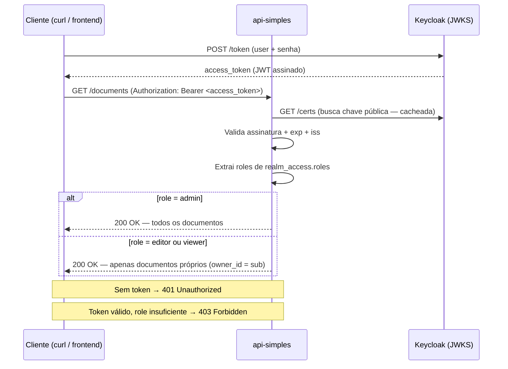
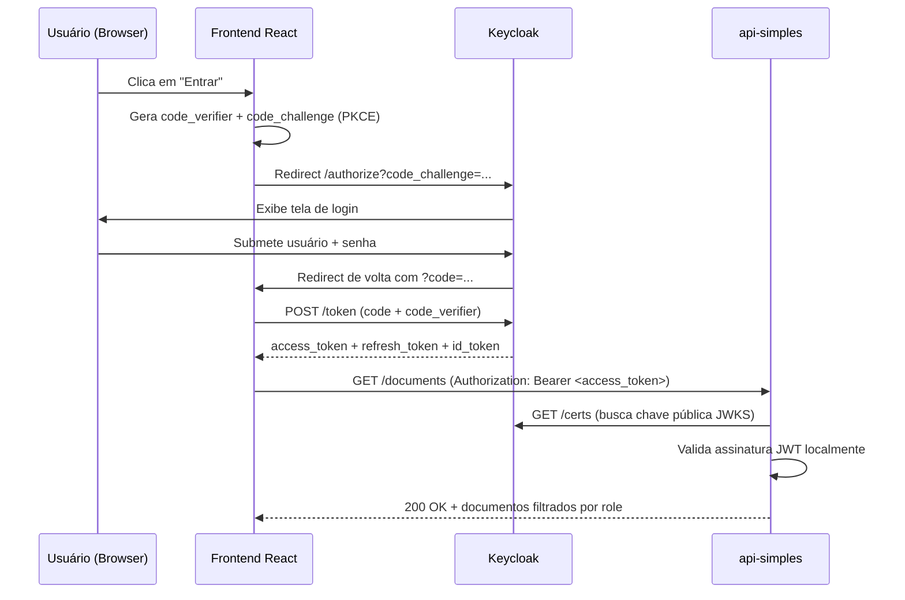
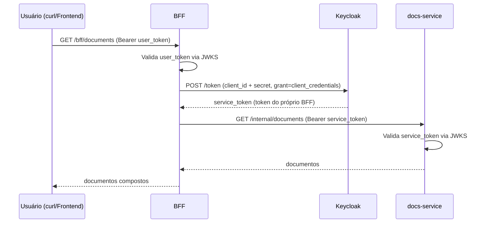

# 08 — Keycloak: Identity & Access Management em Sistemas Distribuídos

## 📖 Descrição

O **Keycloak** é um servidor de **Identity & Access Management (IAM)** open-source que centraliza autenticação, autorização e gerenciamento de identidades para múltiplas aplicações. Em sistemas distribuídos, ele resolve um problema fundamental: como garantir que **apenas usuários e serviços autorizados** acessem recursos protegidos, sem que cada aplicação precise implementar login, gerenciamento de senhas e controle de acesso individualmente.

Este projeto explora o Keycloak de forma progressiva e prática, por meio de **três samples independentes** que demonstram cenários de uso distintos, todos compartilhando a mesma instância de Keycloak. O domínio adotado é o de **documentos** — simples o suficiente para não distrair do foco real: **autenticação e autorização**.

---

## 🏗️ Arquitetura

### Visão Geral

```
                        ┌─────────────────────────────────┐
                        │  Keycloak (IAM Server :8080)     │
                        │  - Realm: distributed-systems    │
                        │  - Emite JWTs assinados (RS256)  │
                        │  - Admin UI: /admin              │
                        └─────────────┬───────────────────┘
                                      │ PostgreSQL :5432
                                      │ (persistência do Keycloak)
         ┌────────────────────────────┼────────────────────────────┐
         │                            │                            │
         ▼                            ▼                            ▼
┌────────────────┐          ┌─────────────────┐        ┌──────────────────────┐
│  Sample A      │          │  Sample B        │        │  Sample C            │
│  api-simples   │          │  frontend-pkce   │        │  bff-m2m             │
│  (FastAPI:8001)│          │  (React:5173)    │        │  BFF (FastAPI:8002)  │
│                │          │        │         │        │  + docs-service      │
│  JWT validation│          │        │ chama   │        │    (FastAPI:8003)    │
│  RBAC: roles   │◄─────────┤  com token       │        │                      │
│  (GET/POST docs│          │  no header       │        │  BFF: valida user JWT│
└────────────────┘          └─────────────────┘        │  M2M: Client Creds  │
                                                        └──────────────────────┘
```

### O que cada Sample demonstra

| Sample | Tecnologia | Flow OAuth2 | Conceito principal |
|--------|------------|-------------|-------------------|
| A — api-simples | FastAPI | — (apenas valida tokens) | JWT validation, JWKS, RBAC |
| B — frontend-pkce | React + Vite | Authorization Code + PKCE | Login no browser, token lifecycle |
| C — bff-m2m | FastAPI (BFF + downstream) | Client Credentials | M2M auth, service-to-service |

### Fluxo do Sample A (JWT Validation + RBAC)



### Fluxo do Sample B (Authorization Code + PKCE)



### Fluxo do Sample C (Client Credentials — M2M)



---

## 🚀 Stack

| Componente | Tecnologia |
|------------|-----------|
| IAM Server | Keycloak 24 |
| Banco do Keycloak | PostgreSQL 16 |
| Samples backend | Python 3.12 + FastAPI + python-jose |
| Sample frontend | React 18 + TypeScript + Vite 5 |
| Infraestrutura | Docker Compose |

---

## 🎯 Objetivos do Projeto

- Entender o que é um **Authorization Server** e por que centralizá-lo faz sentido em sistemas distribuídos.
- Dominar os **dois flows OAuth2** mais usados na prática: Authorization Code + PKCE (browser) e Client Credentials (M2M).
- Compreender a estrutura de um **JWT** por dentro: header, payload, assinatura, claims.
- Implementar **validação local de JWT** via JWKS — sem chamar o Keycloak a cada requisição.
- Aplicar **RBAC** (Role-Based Access Control) em endpoints de API usando roles do token.
- Entender o **lifecycle dos tokens**: access token curto, refresh token longo, logout com invalidação.
- Conhecer a diferença entre **validação local** (rápida) e **token introspection** (revogação imediata).
- Tratar o Keycloak como **código**: exportar e importar a configuração do Realm via JSON.

---

## 🧩 Domínio

O domínio adotado é o de **documentos** — propositalmente simples para não distrair do foco real, que é autenticação e autorização.

### Usuários de exemplo (pré-configurados no Realm)

| Usuário | Senha | Role | O que pode fazer |
|---------|-------|------|-----------------|
| `alice` | `alice123` | `admin` | Lê e gerencia todos os documentos |
| `bob` | `bob123` | `editor` | Cria e edita os próprios documentos |
| `carol` | `carol123` | `viewer` | Apenas lê documentos (sem criar) |

### Endpoints protegidos da api-simples (Sample A)

| Método | Endpoint | Roles permitidos | Comportamento |
|--------|----------|-----------------|---------------|
| `GET` | `/documents` | viewer, editor, admin | `admin` vê todos; outros veem apenas os próprios |
| `POST` | `/documents` | editor, admin | Cria documento com owner = sub do token |
| `GET` | `/documents/{id}` | viewer, editor, admin | `admin` acessa qualquer; outros apenas os próprios |
| `DELETE` | `/documents/{id}` | admin | Apenas admin pode excluir |
| `GET` | `/me` | qualquer autenticado | Retorna claims do token (fins didáticos) |

---

## 📁 Estrutura do Projeto

```
08-keycloak/
├── README.md
├── docker-compose.yml              # Keycloak + PostgreSQL + 3 samples
├── .env.example
├── .gitignore
│
├── keycloak/
│   └── realm-export.json           # Realm configurado como código (IaC)
│                                   # Importado automaticamente no startup
│
└── samples/
    │
    ├── api-simples/                # Sample A — FastAPI protegida por JWT
    │   ├── Dockerfile
    │   ├── requirements.txt
    │   └── app/
    │       ├── main.py
    │       ├── config.py           # KEYCLOAK_URL, REALM, CLIENT_ID via env
    │       ├── auth.py             # Middleware JWKS + extração de roles
    │       └── routers/
    │           └── documents.py   # CRUD de documentos com RBAC
    │
    ├── frontend-pkce/              # Sample B — React com PKCE manual
    │   ├── Dockerfile
    │   ├── package.json
    │   ├── vite.config.ts
    │   └── src/
    │       ├── main.tsx
    │       ├── App.tsx
    │       ├── auth/
    │       │   ├── pkce.ts         # Geração de code_verifier / code_challenge
    │       │   └── tokens.ts      # Troca de code, refresh, logout
    │       └── components/
    │           ├── LoginButton.tsx
    │           ├── TokenViewer.tsx # Exibe claims decodificados (didático)
    │           └── DocumentsList.tsx
    │
    └── bff-m2m/                   # Sample C — BFF + downstream (M2M)
        ├── bff/
        │   ├── Dockerfile
        │   ├── requirements.txt
        │   └── app/
        │       ├── main.py
        │       ├── config.py
        │       ├── auth.py         # Valida token do usuário
        │       └── clients/
        │           └── docs_client.py  # Chama docs-service com Client Credentials
        └── docs-service/
            ├── Dockerfile
            ├── requirements.txt
            └── app/
                ├── main.py
                ├── config.py
                └── auth.py         # Valida token do BFF (não do usuário)
```

---

## 🔌 Portas

| Serviço | Endereço |
|---------|----------|
| Keycloak Admin UI | http://localhost:8080/admin |
| Keycloak (issuer) | http://localhost:8080/realms/distributed-systems |
| PostgreSQL | localhost:5432 |
| api-simples (Sample A) | http://localhost:8001 |
| frontend-pkce (Sample B) | http://localhost:5173 |
| BFF (Sample C) | http://localhost:8002 |
| docs-service (Sample C) | http://localhost:8003 |

---

## ⚙️ Configuração do Keycloak (Realm)

O Realm `distributed-systems` é **importado automaticamente** no startup do Keycloak a partir de `keycloak/realm-export.json`. Não é necessária configuração manual.

### Clients configurados

| Client ID | Tipo | Usado por | Flow |
|-----------|------|-----------|------|
| `api-simples` | Confidential | Sample A | Valida tokens (resource server) |
| `frontend-pkce` | Public | Sample B | Authorization Code + PKCE |
| `bff-client` | Confidential | Sample C (BFF) | Client Credentials |
| `docs-service` | Confidential | Sample C (downstream) | Valida tokens de serviço |

---

## 🏃 Como Subir o Projeto

```bash
# 1. Entrar no diretório
cd distributed-systems-playground/08-keycloak

# 2. Configurar variáveis de ambiente
cp .env.example .env

# 3. Subir toda a infraestrutura
docker compose up --build -d

# 4. Aguardar o Keycloak inicializar (~30s) e acessar a Admin UI
open http://localhost:8080/admin
# Login: admin / admin

# 5. Acessar os samples
open http://localhost:5173    # Frontend PKCE (Sample B)

# 6. Testar a api-simples com curl (Sample A)
# Obter token para alice (admin):
TOKEN=$(curl -s -X POST \
  "http://localhost:8080/realms/distributed-systems/protocol/openid-connect/token" \
  -d "grant_type=password&client_id=api-simples&username=alice&password=alice123" \
  | python3 -c "import sys,json; print(json.load(sys.stdin)['access_token'])")

curl -H "Authorization: Bearer $TOKEN" http://localhost:8001/documents
```

---

## 🔑 Conceitos-chave Cobertos

### Os três tokens do OIDC

| Token | Propósito | Enviado para... | Tempo de vida típico |
|-------|-----------|-----------------|----------------------|
| **Access Token** | "O que você pode fazer" | APIs e serviços | 5–15 minutos |
| **ID Token** | "Quem você é" | Apenas o cliente (frontend) | Sessão |
| **Refresh Token** | "Renovar sem novo login" | Apenas o Authorization Server | 1–8 horas |

### OAuth2 Flows implementados

```
Authorization Code + PKCE  →  Sample B (browser/SPA)
Client Credentials         →  Sample C (M2M)
```

### Validação local vs Token Introspection

```
Validação local (JWKS):
  serviço → verifica assinatura com chave pública → resposta em <1ms
  ✅ Rápido   ❌ Token revogado continua válido até expirar

Token Introspection:
  serviço → pergunta ao Keycloak → resposta em ~50ms
  ✅ Revogação imediata   ❌ Dependência de rede no Keycloak
```

---

# [OK] Epic 1 — Fundação Keycloak

## [OK] Card 1 — Subir Keycloak com PostgreSQL no Docker Compose

Descrição: Criar o `docker-compose.yml` com os serviços `keycloak` (imagem `quay.io/keycloak/keycloak:24`) e `postgres` (imagem `postgres:16`). O Keycloak deve usar o PostgreSQL como banco de dados. Configurar o admin com usuário e senha via variáveis de ambiente. Validar que o Admin UI está acessível em `http://localhost:8080/admin` após o startup.

## [OK] Card 2 — Admin UI: criar Realm, Clients, Roles e Usuários

Descrição: Acessar o Admin UI e configurar manualmente o Realm `distributed-systems`: criar as Realm Roles (`admin`, `editor`, `viewer`), criar os 4 Clients (`api-simples`, `frontend-pkce`, `bff-client`, `docs-service`) com os tipos corretos (public vs confidential), criar os usuários `alice`, `bob` e `carol` com suas respectivas roles e senhas. O objetivo deste card é entender a hierarquia Realm → Client → Role → User na interface.

## [OK] Card 3 — Exportar Realm como código (realm-export.json)

Descrição: Exportar toda a configuração do Realm criada no Card 2 como `keycloak/realm-export.json`. Configurar o Docker Compose para importar este arquivo automaticamente no startup com a flag `--import-realm`. Derrubar e subir o ambiente do zero (`docker compose down -v && docker compose up --build -d`) e validar que toda a configuração (clients, roles, usuários) foi restaurada automaticamente sem nenhum passo manual.

## [OK] Card 4 — Anatomia do JWT — decodificar e entender cada claim

Descrição: Obter um token real do Keycloak para cada usuário (`alice`, `bob`, `carol`) usando o Resource Owner Password Credentials grant via `curl`. Decodificar cada token em `jwt.io` e identificar: `sub` (identificador único do usuário), `exp` (expiração), `iss` (quem emitiu), `aud` (para quem é o token), `realm_access.roles` (roles do usuário) e `azp` (client que solicitou). Observar as diferenças entre o Access Token, o ID Token e o Refresh Token.

---

# [*] Epic 2 — Sample A: API Simples

## [*] Card 5 — Estrutura base da api-simples

Descrição: Criar a estrutura inicial do Sample A: FastAPI com dados de documentos em memória (sem banco — o foco é auth, não persistência). Cada documento tem `id`, `title`, `owner_id` e `content`. Implementar os endpoints listados na seção de Domínio, por enquanto sem qualquer proteção. Subir no Docker Compose na porta 8001.

## [*] Card 6 — Middleware de autenticação via JWKS

Descrição: Implementar em `auth.py` um middleware FastAPI que: (1) extrai o Bearer token do header `Authorization`; (2) busca a chave pública do Keycloak via `GET /.well-known/openid-configuration` → `jwks_uri`; (3) valida a assinatura do token localmente usando `python-jose`; (4) retorna HTTP 401 se o token for inválido ou expirado. A chave pública deve ser cacheada em memória (não buscar no Keycloak a cada requisição).

## [*] Card 7 — RBAC nos endpoints

Descrição: Extrair o campo `realm_access.roles` do payload do JWT e aplicar controle de acesso nos endpoints: `GET /documents` retorna todos os documentos para `admin` e apenas os próprios para `editor`/`viewer`; `POST /documents` exige role `editor` ou `admin`; `DELETE /documents/{id}` exige role `admin`. Retornar HTTP 403 quando o usuário está autenticado mas não tem a role necessária.

## [*] Card 8 — Testar com curl os três usuários

Descrição: Criar um script `samples/api-simples/scripts/test_rbac.sh` que: obtém tokens para `alice`, `bob` e `carol`; testa cada endpoint com cada usuário; e valida os códigos de resposta esperados (ex: `carol` fazendo `POST` deve receber 403, `alice` fazendo `GET /documents` deve receber todos os documentos). Documentar a saída esperada no script.

## [*] Card 9 — 401 vs 403 — semantica correta

Descrição: Garantir que a API usa a semântica HTTP correta: `401 Unauthorized` quando não há token ou o token é inválido/expirado ("não sei quem você é"); `403 Forbidden` quando o token é válido mas o usuário não tem permissão ("sei quem você é, mas não pode fazer isso"). Adicionar mensagens de erro padronizadas com o campo `detail` explicando o motivo.

---

# [*] Epic 3 — Sample B: Frontend PKCE

## [*] Card 10 — Estrutura base do frontend React + Vite

Descrição: Criar a estrutura inicial do Sample B: React 18 + Vite 5 + TypeScript. Configurar o Vite com proxy para `/api` apontando para a `api-simples` (porta 8001). Criar a UI base com duas áreas: uma para o estado de autenticação (botão de login/logout, nome do usuário) e outra para a lista de documentos. Subir no Docker Compose na porta 5173.

## [*] Card 11 — PKCE manual: code_verifier e code_challenge

Descrição: Implementar em `src/auth/pkce.ts` a geração do par PKCE: `code_verifier` (string aleatória de 43-128 caracteres) e `code_challenge` (SHA-256 do verifier, codificado em base64url). Implementar também a construção da URL de autorização com os parâmetros `response_type=code`, `client_id`, `redirect_uri`, `scope=openid profile`, `state` (anti-CSRF), `code_challenge` e `code_challenge_method=S256`. Exibir cada passo na tela com fins didáticos.

## [*] Card 12 — Redirect para login e captura do authorization code

Descrição: Implementar o botão "Entrar" que redireciona o browser para a URL de autorização construída no Card 11. Após o Keycloak autenticar o usuário, ele redireciona de volta para a aplicação com `?code=...&state=...` na URL. Implementar a captura desses parâmetros no callback, validar o `state` (anti-CSRF) e armazenar o `code` temporariamente para a próxima etapa.

## [*] Card 13 — Troca do code pelos tokens

Descrição: Implementar em `src/auth/tokens.ts` a troca do authorization code pelos tokens: `POST` para o endpoint `/token` do Keycloak com `grant_type=authorization_code`, `code`, `redirect_uri`, `client_id` e `code_verifier` (o segredo do PKCE). Armazenar `access_token`, `refresh_token` e `id_token` na memória (não em localStorage por segurança). Exibir os três tokens decodificados na `TokenViewer` component.

## [*] Card 14 — TokenViewer: inspecionar claims na UI

Descrição: Criar o componente `TokenViewer.tsx` que decodifica (sem verificar assinatura — apenas base64) e exibe os claims de cada token de forma legível: nome do usuário, email, roles, `sub`, `exp` (formatado como data), `iss`. Destacar visualmente a diferença entre o que o Access Token e o ID Token contêm. Objetivo didático: deixar o conteúdo do JWT visível e tangível.

## [*] Card 15 — Chamar a api-simples autenticado

Descrição: Implementar `DocumentsList.tsx` que chama `GET /api/documents` com o Access Token no header `Authorization: Bearer <token>`. Exibir os documentos retornados. Testar com os três usuários (alice, bob, carol) e observar a diferença no resultado: alice vê todos, bob e carol veem apenas os próprios. Tratar erros de 401 e 403 com mensagens claras na UI.

## [*] Card 16 — Refresh token automático

Descrição: Implementar a renovação automática do Access Token usando o Refresh Token. Quando uma chamada à API retorna 401 (token expirado), o cliente deve automaticamente fazer `POST /token` com `grant_type=refresh_token` e o refresh token atual, trocar pelos novos tokens e repetir a chamada original sem intervenção do usuário. Exibir na UI quando um refresh aconteceu (para fins didáticos).

## [*] Card 17 — Logout com invalidação no Keycloak

Descrição: Implementar o botão "Sair" que: (1) chama o endpoint `/logout` do Keycloak com o `refresh_token` para invalidar a sessão no servidor; (2) limpa os tokens da memória local; (3) redireciona para a tela inicial. Demonstrar que após o logout, o refresh token não funciona mais (diferente de apenas apagar o token local, onde o refresh ainda seria válido até expirar).

---

# [*] Epic 4 — Sample C: BFF + M2M

## [*] Card 18 — Estrutura base do BFF e do docs-service

Descrição: Criar os dois serviços do Sample C: `bff` (porta 8002) e `docs-service` (porta 8003). O `bff` expõe endpoints em `/bff/*` que o usuário externo chama; o `docs-service` expõe endpoints em `/internal/*` que só o BFF pode chamar (não expostos diretamente ao usuário). Ambos sobem no Docker Compose. Por enquanto sem autenticação — apenas a estrutura de rotas e dados de exemplo em memória.

## [*] Card 19 — BFF valida token do usuário

Descrição: Implementar no BFF o mesmo middleware de validação JWT do Sample A (JWKS, validação local, extração de roles). O BFF deve rejeitar chamadas sem token válido com 401, e aplicar RBAC básico (admin vs editor vs viewer) no que expõe ao usuário. A partir deste card, o BFF sabe quem é o usuário que está chamando.

## [*] Card 20 — BFF obtém token próprio via Client Credentials

Descrição: Implementar em `bff/app/clients/docs_client.py` a obtenção de um token de serviço usando Client Credentials: `POST /token` com `grant_type=client_credentials`, `client_id=bff-client` e `client_secret`. O BFF deve cachear esse token em memória e renová-lo apenas quando expirar (sem buscar um novo a cada requisição). Usar esse token de serviço para chamar o `docs-service`.

## [*] Card 21 — docs-service valida token do BFF

Descrição: Implementar no `docs-service` a validação do token de serviço recebido do BFF. O `docs-service` não sabe (nem precisa saber) quem é o usuário final — ele apenas valida que foi o `bff-client` autorizado que chamou. Validar que o `docs-service` retorna 401 se chamado diretamente sem token (mesmo de um usuário válido com token de usuário), demonstrando o isolamento.

## [*] Card 22 — Demonstrar a diferença entre token de usuário e token de serviço

Descrição: Criar um endpoint `GET /bff/debug/tokens` que retorna (apenas em modo dev) os claims dos dois tokens em uso: o token do usuário que chamou o BFF e o token de serviço que o BFF usa para chamar o `docs-service`. Destacar as diferenças: `sub` (usuário humano vs `bff-client`), `scope`, `azp` e ausência de roles de usuário no token de serviço.

---

# [*] Epic 5 — Token Lifecycle e Conceitos Avançados

## [*] Card 23 — Configurar TTLs de token no Keycloak

Descrição: Ajustar no Realm export os TTLs dos tokens: Access Token com vida curta (2 minutos, para facilitar testes de expiração), Refresh Token com vida longa (30 minutos). Validar o comportamento no Sample B: após 2 minutos, uma chamada à API deve retornar 401, disparar o refresh automático do Card 16, e a chamada ser repetida com sucesso. Observar os claims `exp` e `iat` no TokenViewer.

## [*] Card 24 — Validação local vs Token Introspection

Descrição: Implementar no Sample A dois endpoints paralelos: `GET /documents` (usa validação local via JWKS, resposta em <5ms) e `GET /documents-introspect` (usa Token Introspection — chama `POST /token/introspect` no Keycloak a cada requisição). Criar um script de benchmark que mede a latência de 100 requisições em cada abordagem e exibe a diferença. Revogar um token no Admin UI e demonstrar que a validação local ainda o aceita enquanto o introspect o rejeita imediatamente.

## [*] Card 25 — Scopes customizados

Descrição: Criar um scope customizado `documents:read` e `documents:write` no Realm. Configurar o `frontend-pkce` para solicitar apenas `documents:read` no momento do login. Implementar no Sample A a verificação de scopes além de roles: `POST /documents` exige o scope `documents:write`. Demonstrar que um usuário com role `editor` mas sem o scope `documents:write` recebe 403 — mostrando que roles e scopes são controles complementares.

---

# [*] Epic 6 — Consolidação

## [*] Card 26 — Script de validação end-to-end

Descrição: Criar `scripts/validate_all_samples.sh` que valida os três samples automaticamente: obtém tokens para alice, bob e carol; testa os endpoints do Sample A com cada usuário validando os status HTTP esperados; verifica que o Sample C rejeita chamadas diretas ao `docs-service`; exibe um resumo de PASS/FAIL. O script deve funcionar com `bash scripts/validate_all_samples.sh` após `docker compose up --build -d`.

## [*] Card 27 — Consolidar aprendizados no README

Descrição: Adicionar ao README a seção **Lições Aprendidas** cobrindo: o que o Keycloak resolve que uma implementação própria de auth não resolveria tão bem; a diferença real entre OAuth2 (autorização) e OpenID Connect (autenticação); quando usar Authorization Code + PKCE vs Client Credentials; por que validação local é rápida mas tem o problema de revogação; e quando faz sentido (ou não) usar um IAM externo.
